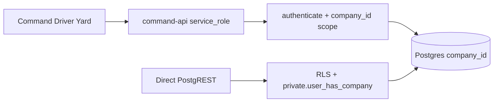

# Multi-Tenant Readiness Audit

> Generated from the live Supabase project linked to Command Admin.  
> Tenancy key in this repo is **`company_id`** (not `organisation_id`).  
> “Organisation / Tenant” in product language = `companies` row.  
> “Workspace” = active company session (`app_metadata.active_company_id`).  
> “Veyvio Platform” = `platform_users` + platform tables + Platform Admin routes.

## 1. Platform boundaries (target model)

| Concept | Product meaning | This codebase today |
|---|---|---|
| **Veyvio Platform** | Owned by Veyvio; licences, suspend, support | `platform_users`, `platform_audit_logs`, `subscription_plans`, `plan_features`; Command routes `/platform/*` (MVP inside Command deploy — extract later) |
| **Organisation / Tenant** | Company buying a licence | `companies` + `company_subscriptions` + `tenant_status` |
| **Workspace** | Environment a user enters after select-company | JWT `active_company_id` + `company_memberships` |

**Rule:** Demo / CoLoop / any fleet operator is a normal tenant. It must never be hard-coded as “the platform”.

## 2. Architecture reality (isolation model)



- **Primary enforcement:** Command API with service role — isolation is **code discipline** (`authenticate`, `assertCompanyScoped*`, `requireModule`).
- **Secondary enforcement:** RLS for any direct PostgREST access.
- Isolation smoke exists: `Veyvio admin /scripts/tenant-isolation-smoke.mjs` (`npm run test:tenant-isolation`) — **not yet a required CI job**.

## 3. Executive findings

| Area | Status | Notes |
|---|---|---|
| Tenancy column | Strong | Almost all ops tables use `company_id` |
| RLS enabled | Strong | App tables have RLS; recent Advisor “no policy” gaps closed |
| Company helper in policies | Strong | Most tenant tables use `private.user_has_company` |
| Join tables without `company_id` | Gap | 7 tables scoped only via parent FK — FK composite checks needed |
| Mutations via PostgREST | Gap | Many tables are **select-only** under RLS; writes go through API (good) but API must stay company-scoped |
| Storage | Partial | Only `driver-documents`; path folder = company UUID; client mutations denied |
| Cross-tenant tests | Partial | Smoke covers vehicle/driver/duty IDOR; missing assign/link/upload/report/RPC matrix |
| Licence model | Partial | `subscription_plans`, `plan_features`, `company_subscriptions`, overrides exist — not full billing ledger |
| Entitlement enforcement | Partial | `resolveEntitlements` + API module gate + sidebar soft-gate — not a shared `@veyvio/entitlements` package |
| Platform Admin | Partial | `/platform/*` inside Command — not a separate app yet |
| CI gate | Missing | No GitHub Action for tenant isolation |

### Highest-priority fixes (Sprint 1)

1. ~~**`notifications`**~~ — fixed in `202607230006` (recipient + `private.user_has_company`).
2. ~~**Join tables**~~ — open authenticated SELECT replaced with parent EXISTS; same-company triggers on `depot_access`, `duty_runs`, `run_trips`.
3. ~~**API write paths**~~ — `createDraftDuty` / `assignDuty` assert company-scoped driver/vehicle/depot.
4. ~~**Storage matrix**~~ — isolation seed uploads company-prefix probe; smoke proves Org B lists empty for Org A prefix.
5. ~~**CI**~~ — job `tenant-isolation` in `.github/workflows/ci.yml` (`VEYVIO_ANON_KEY` required when `CI=true`).

Trust boundary: [`13-postgrest-vs-command-api.md`](./13-postgrest-vs-command-api.md).

## 4. Full table register

Legend — **Risk**:
- `OK` — RLS on + appropriate policies for role
- `INFO_select_scoped_mutations_via_api` — authenticated SELECT company-scoped; writes expected via service-role API
- `MEDIUM_join_no_company_id` — no `company_id`; depends on parent FK / EXISTS policies
- `HIGH_*` — must fix before selling licences
- `n/a_system` — Supabase internal storage catalog


### Critical / high — fix in Sprint 1 (0)

| Schema | Table | company_id | RLS | Policies (S/I/U/D) | Company helper | Risk |
|---|---|---|---|---|---|---|
| — | — | — | — | — | — | _(none after `202607230006`)_ |

### Join tables without company_id (parent-scoped only) (7)

| Schema | Table | company_id | RLS | Policies (S/I/U/D) | Company helper | Risk |
|---|---|---|---|---|---|---|
| public | `depot_access` | N | Y | 1/0/0/0 | Y | `MEDIUM_join_no_company_id` |
| public | `driver_capabilities` | N | Y | 1/0/0/0 | N | `MEDIUM_join_no_company_id` |
| public | `duty_runs` | N | Y | 1/0/0/0 | N | `MEDIUM_join_no_company_id` |
| public | `invitation_events` | N | Y | 1/0/0/0 | Y | `MEDIUM_join_no_company_id` |
| public | `role_permissions` | N | Y | 1/0/0/0 | Y | `MEDIUM_join_no_company_id` |
| public | `run_trips` | N | Y | 1/0/0/0 | N | `MEDIUM_join_no_company_id` |
| public | `vehicle_capabilities` | N | Y | 1/0/0/0 | N | `MEDIUM_join_no_company_id` |

### Needs classification / review (0)

| Schema | Table | company_id | RLS | Policies (S/I/U/D) | Company helper | Risk |
|---|---|---|---|---|---|---|

### Tenant operational tables (company_id) (75)

| Schema | Table | company_id | RLS | Policies (S/I/U/D) | Company helper | Risk |
|---|---|---|---|---|---|---|
| public | `adblue_records` | Y | Y | 1/1/1/1 | Y | `OK` |
| public | `attendance_day_overrides` | Y | Y | 1/1/1/1 | Y | `OK` |
| public | `attendance_leave_audit` | Y | Y | 1/1/1/1 | Y | `OK` |
| public | `attendance_leave_requests` | Y | Y | 1/1/1/1 | Y | `OK` |
| public | `attendance_notes` | Y | Y | 1/1/1/1 | Y | `OK` |
| public | `attendance_return_to_work` | Y | Y | 1/1/1/1 | Y | `OK` |
| public | `audit_events` | Y | Y | 1/0/0/0 | Y | `INFO_select_scoped_mutations_via_api` |
| public | `booking_legs` | Y | Y | 1/0/0/0 | Y | `INFO_select_scoped_mutations_via_api` |
| public | `bookings` | Y | Y | 1/0/0/0 | Y | `INFO_select_scoped_mutations_via_api` |
| public | `command_page_snapshots` | Y | Y | 1/0/0/0 | Y | `INFO_select_scoped_mutations_via_api` |
| public | `company_contract_acceptances` | Y | Y | 1/0/0/0 | Y | `INFO_select_scoped_mutations_via_api` |
| public | `company_holiday_defaults` | Y | Y | 1/0/0/0 | Y | `INFO_select_scoped_mutations_via_api` |
| public | `contracts` | Y | Y | 1/0/0/0 | Y | `INFO_select_scoped_mutations_via_api` |
| public | `customer_contacts` | Y | Y | 1/0/0/0 | Y | `INFO_select_scoped_mutations_via_api` |
| public | `customers` | Y | Y | 1/0/0/0 | Y | `INFO_select_scoped_mutations_via_api` |
| public | `data_export_jobs` | Y | Y | 1/0/0/0 | Y | `INFO_select_scoped_mutations_via_api` |
| public | `data_retention_policies` | Y | Y | 1/0/0/0 | Y | `INFO_select_scoped_mutations_via_api` |
| public | `defects` | Y | Y | 1/0/0/0 | Y | `INFO_select_scoped_mutations_via_api` |
| public | `depot_zones` | Y | Y | 1/0/0/0 | Y | `INFO_select_scoped_mutations_via_api` |
| public | `depots` | Y | Y | 1/0/0/0 | Y | `INFO_select_scoped_mutations_via_api` |
| public | `device_sync_cursors` | Y | Y | 1/1/1/1 | Y | `OK` |
| public | `dispatch_assignment_requests` | Y | Y | 1/0/0/0 | Y | `INFO_select_scoped_mutations_via_api` |
| public | `dispatch_overrides` | Y | Y | 1/0/0/0 | Y | `INFO_select_scoped_mutations_via_api` |
| public | `document_versions` | Y | Y | 1/0/0/0 | Y | `INFO_select_scoped_mutations_via_api` |
| public | `driver_app_accounts` | Y | Y | 1/0/0/0 | Y | `INFO_select_scoped_mutations_via_api` |
| public | `driver_app_devices` | Y | Y | 1/0/0/0 | Y | `INFO_select_scoped_mutations_via_api` |
| public | `driver_documents` | Y | Y | 1/0/0/0 | Y | `INFO_select_scoped_mutations_via_api` |
| public | `driver_eligibility_results` | Y | Y | 1/0/0/0 | Y | `INFO_select_scoped_mutations_via_api` |
| public | `driver_holiday_profiles` | Y | Y | 1/0/0/0 | Y | `INFO_select_scoped_mutations_via_api` |
| public | `driver_requirement_requests` | Y | Y | 1/0/0/0 | Y | `INFO_select_scoped_mutations_via_api` |
| public | `driver_requirements` | Y | Y | 1/0/0/0 | Y | `INFO_select_scoped_mutations_via_api` |
| public | `driver_restrictions` | Y | Y | 1/0/0/0 | Y | `INFO_select_scoped_mutations_via_api` |
| public | `driver_training` | Y | Y | 1/0/0/0 | Y | `INFO_select_scoped_mutations_via_api` |
| public | `drivers` | Y | Y | 1/0/0/0 | Y | `INFO_select_scoped_mutations_via_api` |
| public | `duties` | Y | Y | 1/0/0/0 | Y | `INFO_select_scoped_mutations_via_api` |
| public | `duty_acknowledgements` | Y | Y | 1/1/1/1 | Y | `OK` |
| public | `duty_assignment_events` | Y | Y | 1/1/1/1 | Y | `OK` |
| public | `duty_live_positions` | Y | Y | 1/1/1/1 | Y | `OK` |
| public | `evidence_links` | Y | Y | 1/0/0/0 | Y | `INFO_select_scoped_mutations_via_api` |
| public | `file_objects` | Y | Y | 1/0/0/0 | Y | `INFO_select_scoped_mutations_via_api` |
| public | `holiday_ledger_entries` | Y | Y | 1/0/0/0 | Y | `INFO_select_scoped_mutations_via_api` |
| public | `holiday_pay_records` | Y | Y | 1/0/0/0 | Y | `INFO_select_scoped_mutations_via_api` |
| public | `incidents` | Y | Y | 1/0/0/0 | Y | `INFO_select_scoped_mutations_via_api` |
| public | `invitations` | Y | Y | 1/0/0/0 | Y | `INFO_select_scoped_mutations_via_api` |
| public | `maintenance_work_orders` | Y | Y | 1/0/0/0 | Y | `INFO_select_scoped_mutations_via_api` |
| public | `messages` | Y | Y | 1/0/0/0 | Y | `INFO_select_scoped_mutations_via_api` |
| public | `notifications` | Y | Y | 1/0/0/0 | Y | `OK` |
| public | `operating_areas` | Y | Y | 1/0/0/0 | Y | `INFO_select_scoped_mutations_via_api` |
| public | `operational_exceptions` | Y | Y | 1/0/0/0 | Y | `INFO_select_scoped_mutations_via_api` |
| public | `outbox_commands` | Y | Y | 1/0/0/0 | Y | `INFO_select_scoped_mutations_via_api` |
| public | `parking_bays` | Y | Y | 1/0/0/0 | Y | `INFO_select_scoped_mutations_via_api` |
| public | `passenger_addresses` | Y | Y | 1/0/0/0 | Y | `INFO_select_scoped_mutations_via_api` |
| public | `passenger_contacts` | Y | Y | 1/0/0/0 | Y | `INFO_select_scoped_mutations_via_api` |
| public | `passenger_needs` | Y | Y | 1/0/0/0 | Y | `INFO_select_scoped_mutations_via_api` |
| public | `passengers` | Y | Y | 1/0/0/0 | Y | `INFO_select_scoped_mutations_via_api` |
| public | `privileged_access_grants` | Y | Y | 1/0/0/0 | Y | `INFO_select_scoped_mutations_via_api` |
| public | `processed_commands` | Y | Y | 1/0/0/0 | Y | `INFO_select_scoped_mutations_via_api` |
| public | `rate_cards` | Y | Y | 1/0/0/0 | Y | `INFO_select_scoped_mutations_via_api` |
| public | `runs` | Y | Y | 1/0/0/0 | Y | `INFO_select_scoped_mutations_via_api` |
| public | `schools` | Y | Y | 1/0/0/0 | Y | `INFO_select_scoped_mutations_via_api` |
| public | `security_events` | Y | Y | 1/0/0/0 | Y | `INFO_select_scoped_mutations_via_api` |
| public | `staff_members` | Y | Y | 1/0/0/0 | Y | `INFO_select_scoped_mutations_via_api` |
| public | `support_access_sessions` | Y | Y | 1/0/0/0 | Y | `INFO_select_scoped_mutations_via_api` |
| public | `sync_conflicts` | Y | Y | 1/0/0/0 | Y | `INFO_select_scoped_mutations_via_api` |
| public | `trip_assignments` | Y | Y | 1/0/0/0 | Y | `INFO_select_scoped_mutations_via_api` |
| public | `trip_events` | Y | Y | 1/0/0/0 | Y | `INFO_select_scoped_mutations_via_api` |
| public | `trip_executions` | Y | Y | 1/0/0/0 | Y | `INFO_select_scoped_mutations_via_api` |
| public | `trips` | Y | Y | 1/0/0/0 | Y | `INFO_select_scoped_mutations_via_api` |
| public | `vehicle_checks` | Y | Y | 1/0/0/0 | Y | `INFO_select_scoped_mutations_via_api` |
| public | `vehicle_report_evidence` | Y | Y | 1/1/1/1 | Y | `OK` |
| public | `vehicle_report_status_history` | Y | Y | 1/1/1/1 | Y | `OK` |
| public | `vehicle_reports` | Y | Y | 1/1/1/1 | Y | `OK` |
| public | `vehicle_status_transitions` | Y | Y | 1/0/0/0 | Y | `INFO_select_scoped_mutations_via_api` |
| public | `vehicles` | Y | Y | 1/0/0/0 | Y | `INFO_select_scoped_mutations_via_api` |
| public | `vor_cases` | Y | Y | 1/0/0/0 | Y | `INFO_select_scoped_mutations_via_api` |

### Tenant root / licensing (5)

| Schema | Table | company_id | RLS | Policies (S/I/U/D) | Company helper | Risk |
|---|---|---|---|---|---|---|
| public | `companies` | N | Y | 1/0/0/0 | Y | `OK` |
| public | `company_entitlement_overrides` | Y | Y | 1/0/0/0 | Y | `INFO_select_scoped_mutations_via_api` |
| public | `company_memberships` | Y | Y | 1/0/0/0 | Y | `INFO_select_scoped_mutations_via_api` |
| public | `company_security_policies` | Y | Y | 1/0/0/0 | Y | `INFO_select_scoped_mutations_via_api` |
| public | `company_subscriptions` | Y | Y | 1/0/0/0 | Y | `INFO_select_scoped_mutations_via_api` |

### Veyvio platform / identity (18)

| Schema | Table | company_id | RLS | Policies (S/I/U/D) | Company helper | Risk |
|---|---|---|---|---|---|---|
| public | `email_verification_challenges` | N | Y | 1/1/1/1 | N | `OK` |
| public | `mfa_login_challenges` | N | Y | 1/0/0/0 | N | `OK` |
| public | `mfa_recovery_codes` | N | Y | 1/0/0/0 | N | `OK` |
| public | `notification_preferences` | N | Y | 1/1/1/1 | N | `OK` |
| public | `password_reset_challenges` | N | Y | 1/0/0/0 | N | `OK` |
| public | `pending_organisations` | N | Y | 1/1/1/1 | N | `OK` |
| public | `pending_users` | N | Y | 1/1/1/1 | N | `OK` |
| public | `permissions` | N | Y | 1/0/0/0 | N | `OK` |
| public | `plan_features` | N | Y | 1/0/0/0 | N | `OK` |
| public | `platform_audit_logs` | N | Y | 1/0/0/0 | N | `OK` |
| public | `platform_users` | N | Y | 1/0/0/0 | N | `OK` |
| public | `roles` | Y | Y | 1/0/0/0 | Y | `INFO_select_scoped_mutations_via_api` |
| public | `signup_risk_assessments` | N | Y | 1/1/1/1 | N | `OK` |
| public | `subscription_plans` | N | Y | 1/0/0/0 | N | `OK` |
| public | `user_devices` | N | Y | 1/0/0/0 | N | `OK` |
| public | `user_mfa_methods` | N | Y | 1/0/0/0 | N | `OK` |
| public | `user_sessions` | N | Y | 1/0/0/0 | N | `OK` |
| public | `users` | N | Y | 1/0/1/0 | N | `OK` |

### Storage (1)

| Schema | Table | company_id | RLS | Policies (S/I/U/D) | Company helper | Risk |
|---|---|---|---|---|---|---|
| storage | `objects` | N | Y | 1/1/1/1 | Y | `OK` |

### Supabase system (ignore for tenant audit) (7)

| Schema | Table | company_id | RLS | Policies (S/I/U/D) | Company helper | Risk |
|---|---|---|---|---|---|---|
| storage | `buckets` | N | Y | 0/0/0/0 | N | `n/a_system` |
| storage | `buckets_analytics` | N | Y | 0/0/0/0 | N | `n/a_system` |
| storage | `buckets_vectors` | N | Y | 0/0/0/0 | N | `n/a_system` |
| storage | `migrations` | N | Y | 0/0/0/0 | N | `n/a_system` |
| storage | `s3_multipart_uploads` | N | Y | 0/0/0/0 | N | `n/a_system` |
| storage | `s3_multipart_uploads_parts` | N | Y | 0/0/0/0 | N | `n/a_system` |
| storage | `vector_indexes` | N | Y | 0/0/0/0 | N | `n/a_system` |


## 5. Storage paths

| Bucket | Public | Path convention | Authenticated access | Gap |
|---|---|---|---|---|
| `driver-documents` | no | `{company_id}/...` | SELECT if `private.user_has_company`; INSERT/UPDATE/DELETE denied | Prove with cross-tenant upload test; ensure API always prefixes company_id |

No other app buckets found in migrations.

## 6. API / Edge surface (must stay tenant-safe)

| Area | Location | Isolation mechanism | Gap |
|---|---|---|---|
| Session auth | `_shared/supabase.ts` `authenticate` | Membership + entitlements + lifecycle | Support grants not full session elevation |
| Company asserts | `_shared/tenant-guards.ts` | `assertCompanyScopedVehicle/Driver/Duty/Defect` | Not on every mutation |
| Module gate | `moduleForApiPath` + `requireModule` | Plan entitlements | Expand limits (drivers/vehicles/multi_depot) |
| Platform admin | `_shared/platform-admin.ts` | `requirePlatformRole` | Still same Command deploy |
| Isolation seed | `_shared/seed-isolation.ts` | Org A/B fixtures | Rename/docs: not “CoLoop as platform” |
| Isolation smoke | `scripts/tenant-isolation-smoke.mjs` | Cross-tenant GET | Expand matrix; add CI |

## 7. Licence model — already present vs requested

| Requested | This repo | Action |
|---|---|---|
| `subscription_plans` | Yes | Keep |
| `plan_features` | Yes | Keep |
| `organisation_subscriptions` | `company_subscriptions` | **Do not rename yet** — alias in docs/API |
| `organisation_entitlements` | `company_entitlement_overrides` + plan features | Add usage limits later |
| `subscription_events` | Missing | Sprint 2 |
| `billing_customers` | `provider_customer_ref` on subscriptions | Sprint 2/4 |
| `usage_limits` | Missing | Sprint 2 |

**SaaS Stripe is deferred (placeholder only).** Platform UI/API use `VEYVIO_SAAS_BILLING_MODE=placeholder` until Sprint 1 CI isolation is green. Do not enable `live` Checkout before then. Driver PHV Stripe is separate and unchanged.

## 8. How to regenerate this audit

```bash
cd "Veyvio admin "
# requires linked project + SUPABASE_ACCESS_TOKEN
npx supabase db query --linked --file scripts/sql/tenant-table-audit.sql
```

SQL source: [`Veyvio admin /scripts/sql/tenant-table-audit.sql`](../../Veyvio%20admin%20/scripts/sql/tenant-table-audit.sql).

## 9. Definition of done for “tenant-ready”

- [x] Zero `HIGH_*` / `CRITICAL_*` rows in this register (notifications closed; re-run audit SQL after push)  
- [x] Join-table same-company FK or denormalized `company_id` proofs  
- [x] Isolation matrix covers read/assign/link/upload/report/RPC  
- [x] `test:tenant-isolation` required in CI  
- [x] CoLoop/demo exists only as seeded tenants, never as platform identity  
