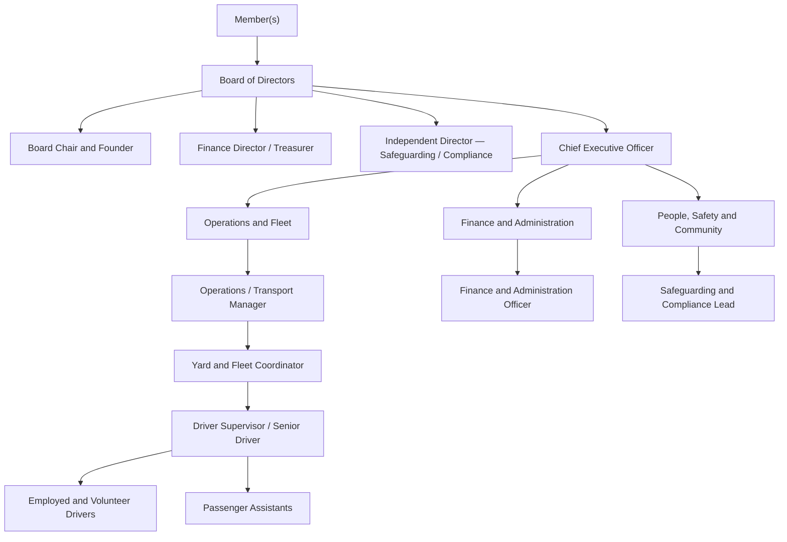
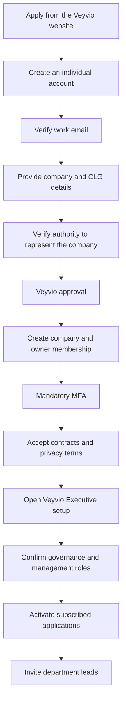

# Veyvio Executive — Product and Company Structure

**Status:** Proposed frontend foundation  
**Purpose:** Define the company-owner, CEO and board layer across the Veyvio application family.

## Product family

Veyvio uses one identity, one company membership and one company context across:

- **Veyvio Executive** — CEO, directors, governance, company setup and cross-company oversight.
- **Veyvio Command** — Transport Manager, scheduling, dispatch, service delivery and fleet operations.
- **Veyvio Finance** — Finance Director, finance team, budgets, costs, forecasts and audit evidence.
- **Veyvio Yard** — Yard coordination, checks, defects, equipment and vehicle movements.
- **Veyvio Driver** — Driver onboarding, duties, journeys, incidents and handback.

Veyvio Executive is the company’s front door. It must not reproduce the detailed operational
workflows owned by Command, Finance, Yard or Driver.

## Organisation structure



## Application access

| Business position | Primary application | Additional access |
|---|---|---|
| Board Chair | Executive | Board packs and reserved decisions |
| Finance Director / Treasurer | Finance | Executive board area |
| Independent Director | Executive | Audit and safeguarding oversight |
| CEO | Executive | Read-level Command and Finance oversight |
| Transport Manager | Command | Operational reports |
| Finance and Administration Officer | Finance | Limited company administration |
| Safeguarding and Compliance Lead | Command | Executive escalations |
| Yard and Fleet Coordinator | Yard | Limited Command fleet access |
| Driver Supervisor | Command | Driver app when operationally required |
| Driver | Driver | Own records and duties |
| Passenger Assistant | Driver | Assigned duty workflow only |
| External Auditor | Finance | Read-only evidence workspace |

## Executive capabilities

1. Executive overview and cross-application exceptions.
2. Company setup and legal profile.
3. Organisation chart, directors, accountable officers and reporting lines.
4. Governance calendar, board decisions, policies and conflicts.
5. Executive approvals and reserved matters.
6. Application activation, invitations and privileged-access review.
7. Security posture, MFA coverage and audit history.
8. App launcher for users with access to more than one Veyvio application.

## Company onboarding



## Identity and permission rules

- Every individual uses their own account; shared mailbox credentials are prohibited.
- `veyvio@outlook.com` may be a contact mailbox but must not be a shared user identity.
- Job title, company position, application access, permission role and approval mandate are
  separate assignments.
- CEO visibility does not automatically grant dispatch, financial reconciliation or safeguarding
  override permissions.
- Users with multiple applications land in an app launcher.
- Users with one application go directly to their authorised application.
- High-risk changes require MFA and, where policy requires it, a second approver.

## Required platform scopes

The shared platform should support:

```text
EXECUTIVE
COMMAND
FINANCE
YARD
DRIVER
PLATFORM
```

The company owner initially enters Executive. They invite the Transport Manager to Command, the
Finance Director to Finance, the Yard Coordinator to Yard, and operational users through their
department’s controlled invitation flow.

