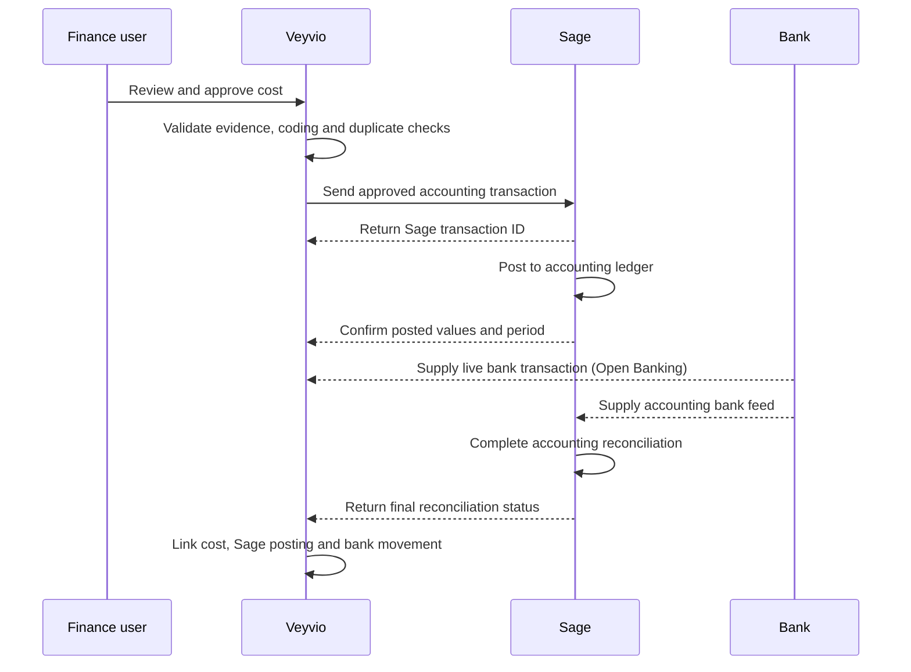

# Cost Control — Sage accounting integration

Veyvio Cost Control **integrates with Sage**; it does not replace Sage.

**Canonical product boundary:** [`veyvio-cost-control/docs/product-boundary.md`](../../veyvio-cost-control/docs/product-boundary.md) (Sage accounting boundary, approved Jul 2026).  
**Related:** Open Banking supporting feed — [`cost-control-bank-open-banking.md`](./cost-control-bank-open-banking.md).

**Product definition:** Veyvio is the CLG’s cost-control, forecasting, approval and audit-evidence platform. Sage is its accounting, tax and statutory financial-record platform.

---

## Responsibility split

| Veyvio | Sage |
|--------|------|
| Cost purpose, budget, forecast, commitment, evidence, approval | General ledger, AP, VAT/MTD, statutory accounts |
| Wage-cost planning + summarised payroll journal export | Final payroll journal + Sage Payroll PAYE/RTI where used |
| Open Banking **proposed** bank match | Official bank accounting reconciliation |
| Audit evidence source | Accounting source |

**Fully reconciled cost** = approved in Veyvio + posted in Sage + matched to bank + Sage reconciliation confirmed.

Identifiers kept separate:

| ID | Owner | Role |
|----|-------|------|
| `veyvio_cost_id` | Veyvio | Cost ledger primary key |
| `open_banking_transaction_id` | AIS partner / Veyvio bank store | Bank movement for proposed match |
| `sage_transaction_id` | Sage | Posted accounting entry |
| `sage_reconciliation_id` | Sage | Official bank reconciliation link |

A bank import must **never** create an extra accounting cost merely because both Veyvio and Sage received the same movement.

---

## Architecture

```text
Approved cost / wage journal / vehicle purchase ref
   → Veyvio export queue (idempotency key + payload version)
    → Token proxy API (server holds Sage client secrets)
     → Sage Accounting / Sage 50 / Intacct API (product TBD)
      → Sage general ledger / AP / VAT
       → Posting + payment + reconciliation status returned
        → Veyvio cost record + Settings exception queue
```



The SPA never stores Sage client secrets. Production always uses a server-side token proxy (same pattern as Open Banking).

---

## What ships today

| Piece | Location |
|-------|----------|
| Domain export / posting types | `veyvio-cost-control/src/integrations/sage/` |
| Demo connection + mappings + failed export queue | `veyvio-cost-control/src/data/sage-seed.ts` |
| Settings UI | Settings → **Sage accounting** |
| Boundary + open decisions | `veyvio-cost-control/docs/product-boundary.md` |

Connect is **disabled** until the CLG confirms which Sage product the accountant will use (**OD-01**).

---

## Gate 0 — product confirmation (CLG / accountant)

Do not implement a live connector until these are answered:

| Question | Options | Notes |
|----------|---------|-------|
| Primary accounting product? | Sage Accounting · Sage 50 · Sage Intacct | Locks API surface and auth model |
| PAYE / RTI product? | Sage Payroll · Sage 50 Payroll · other HMRC-recognised provider | If not Sage Payroll, wage journal still posts into Sage accounting |
| Who authenticates the connection? | Named finance admin / accountant | Sage API permissions follow that user’s roles |
| Sandbox / trial available? | Yes / No | Required before production credentials |
| Nominal, VAT, cost-centre and supplier maps ready? | Draft / Not started | Unmapped rows must not silently export |

Record the answer in the product-boundary **Open decisions register** (`OD-01`, `OD-02`).

---

## Environment variables (planned)

Create `veyvio-cost-control/.env.local` when the token proxy exists:

```bash
# disconnected (default) | sandbox | connected
VITE_SAGE_MODE=disconnected

# undecided | sage_accounting | sage_50 | sage_payroll | sage_50_payroll | sage_intacct
VITE_SAGE_PRODUCT=undecided

# Public client id only (optional until proxy exists)
VITE_SAGE_CLIENT_ID=

# Backend that holds secrets and talks to Sage — required for live
VITE_SAGE_TOKEN_PROXY_URL=

# Consent / OAuth return URL (defaults to this app’s /settings?sage_callback=1)
VITE_SAGE_REDIRECT_URI=http://localhost:5176/settings?sage_callback=1
```

---

## Token proxy API (next backend slice)

When `VITE_SAGE_TOKEN_PROXY_URL` is set, the adapter should call:

| Method | Path | Purpose |
|--------|------|---------|
| GET | `/sage/consent/start` | Return Sage OAuth / auth URL |
| POST | `/sage/consent/complete` | Exchange auth code; store tokens in vault |
| GET | `/sage/connection` | Connection status, business id, open periods |
| GET | `/sage/mappings` | Nominal / VAT / cost-centre / supplier maps |
| PUT | `/sage/mappings` | Update maps (finance admin only) |
| POST | `/sage/exports/supplier-cost` | Send approved supplier cost |
| POST | `/sage/exports/wage-journal` | Send summarised payroll journal |
| POST | `/sage/exports/vehicle-purchase` | Send asset / purchase reference |
| GET | `/sage/postings/:veyvioCostId` | Latest Sage confirmation for a cost |
| GET | `/sage/exceptions` | Failed / rejected exports |
| POST | `/sage/consent/revoke` | Disconnect / reauthorise |

Every request must include `organisation_id`. Tokens are keyed by organisation and never returned to the browser. API access must respect the authenticated Sage user’s permissions (e.g. journal read vs write).

### Transmission controls (every export)

| Field | Requirement |
|-------|-------------|
| Unique Veyvio transaction ID | Required |
| Idempotency key | Required — retries must not duplicate Sage postings |
| Request / response timestamps | Required |
| Payload version | Required (`cost-control.sage-export.v1` today) |
| Sage business identifier | Required when connected |
| Validation result | Required |
| Retry count | Required |
| Failure reason | Required on failure |
| Actor (user or automated process) | Required |
| Immutable event history | Required — no silent correction after reject |

---

## Outbound payloads (Veyvio → Sage)

### Approved supplier cost

| Field | Notes |
|-------|-------|
| `veyvioCostId` | Stable Cost Control id |
| `supplierName` / invoice reference | Must map to Sage supplier where required |
| `invoiceDate` / `accountingDate` | May differ |
| `netMinor` / `vatMinor` / `grossMinor` | Integer pence |
| `sageNominalCode` / `sageTaxCode` | From mapping table |
| `costCentre` / `department` | Mapped where used |
| `vehicleOrProgramme` | Registration or programme code |
| `description` / evidence link / approval date | Evidence remains authoritative in Veyvio |

### Wage journal (summarised only)

| Field | Notes |
|-------|-------|
| Payroll batch reference / pay period | Locked Veyvio batch |
| Gross wages | Employer cost input |
| Employer NI / employer pension / other employer costs | Employer side only |
| Cost centre / department / accounting date | Mapped |
| **Excluded by default** | Employee tax codes, deductions, full payslip lines |

### Vehicle purchase reference

Supplier invoice, asset description, registration/asset ID, purchase date, net/VAT, **proposed** asset category, cost centre, evidence. Accountant decides capitalise / expense / depreciate / lease.

---

## Inbound confirmations (Sage → Veyvio)

| Field | Used for |
|-------|----------|
| `sageTransactionId` | Link to accounting entry |
| Posting date / accounting period | Period close |
| Nominal / tax codes + posted net/VAT/gross | Variance vs Veyvio export |
| `postingStatus` | Sent → Accepted → Rejected → Posted → Paid → Bank reconciled → Reversed |
| Payment status | Unpaid / part paid / paid |
| Credit-note or reversal reference | Immutable correction trail |
| `bankReconciliationStatus` | `unreconciled` · `proposed` · `sage_confirmed` |
| `lastSageUpdateAt` | Freshness on Settings and cost detail |

UI display labels live in `sagePostingDisplayLabel()` (`src/integrations/sage/types.ts`).

---

## Mapping checklist (Settings)

Before enabling live export, finance must complete:

| Map | Example Veyvio key → Sage |
|-----|---------------------------|
| Nominal codes | `fuel` → `5000` |
| VAT / tax codes | `standard` → `T1` |
| Cost centres | `cc_ops` → `OPS` |
| Suppliers | Supplier display name → Sage supplier account |
| Payroll journal | `employer_wage_cost` → Sage journal / nominal set |

Unmapped records stay in Settings and **must not** auto-export. Failed exports appear in the visible exception queue.

---

## Dual bank feed rule

| System | Bank role |
|--------|-----------|
| Veyvio Open Banking | Timely monitoring + **proposed** cost match |
| Sage bank feed / import | Official accounting reconciliation |

Until Sage returns `bankReconciliationStatus: sage_confirmed`, Veyvio must label matches as proposed — never “fully reconciled”.

See also: [`cost-control-bank-open-banking.md`](./cost-control-bank-open-banking.md).

---

## Explicit non-goals

- Customer bookings, routes, dispatch, quotes, sales invoicing, debt chasing  
- Full payroll / PAYE / RTI engine inside Veyvio  
- VAT-return preparation or statutory ledger ownership  
- Claiming Veyvio is the single source of truth for all company data  
- Creating a second accounting cost because both Open Banking and Sage imported the same bank movement  
- Storing Sage passwords or client secrets in the browser  

---

## Implementation phases

| Phase | Outcome | Status |
|-------|---------|--------|
| 0 | Product confirmation (OD-01 / OD-02) | **OPEN** |
| 1 | Domain types + Settings demo (disconnected) | **Done** (Jul 2026) |
| 2 | Token proxy + sandbox OAuth for chosen product | Not started |
| 3 | Supplier-cost export + posting confirmation ingest | Not started |
| 4 | Wage journal export + payroll return link | Not started |
| 5 | Bank reconciliation status sync + full-reconcile gate | Not started |
| 6 | Controlled production: DPIA, accountant UAT, exception queue drill | Not started |

---

## Verify locally (current demo)

```bash
cd veyvio-cost-control
npm test
npm run dev
# Open Settings → Sage accounting
# Confirm: disconnected, undecided product, unmapped rows, failed export sample
```

Live connect remains disabled until Gate 0 answers are recorded.
