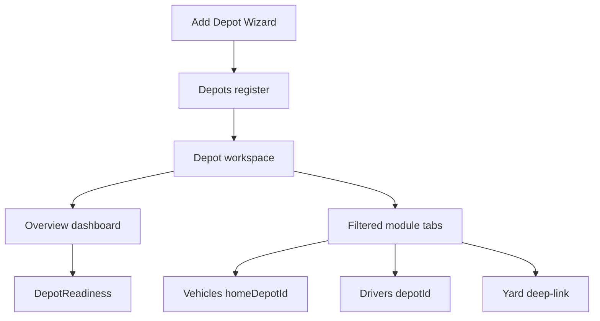

# Veyvio Command — Depots operational headquarters

## Product rule

A depot is the operational home of vehicles, drivers, yard staff, maintenance, fuel, equipment, and runs. Dedicated module pages (Vehicles, Drivers, Yard, Maintenance, Schedule) stay authoritative. **Depots** is the per-location HQ that answers: is this depot ready for service, what is here, and who owns it?

## Aggregate root

Treat Depot as a core aggregate alongside Vehicle, Driver, Run, and Trip. Operational events should carry `depotId` so Command can support multi-depot tenancy, depot-scoped permissions, and like-for-like performance comparisons.

## Count rules

| Metric | Source |
|--------|--------|
| Vehicles assigned | `homeDepotId === depot.id` |
| Vehicles on site | `currentDepotId === depot.id` and yard not checked out |
| Drivers | Primary `depotId` |
| Yard staff on duty | Staff `primaryDepotId` + duty on/break |
| Runs today | Duties linked to vehicles at this depot |

## Module ownership

| Module | Depot relationship |
|--------|-------------------|
| Vehicles | Home depot, transfers, parking, workshop |
| Drivers | Base depot, shift start/end |
| Yard | Live locations, inspections, bays — open `/yard?depot=` |
| Maintenance | Workshop capacity and due work for home fleet |
| Runs / Trips / Schedule / Dispatch | Origin depot and resource pool |
| Checks / Defects / Incidents | Site-scoped operational events |
| Users & Roles | Depot-scoped access (backend `depot_access`) |

## Phase 1 surfaces

- Register cards with status, KPIs, Open
- Workspace tabs: Overview (live) · Vehicles · Drivers · Yard · Maintenance · Equipment · Security · Fuel · Documents · Settings
- 7-step Add Depot Wizard at `/depots/new` (resume `/depots/:id/onboarding`)
- Fuel / Security / Documents are structured stubs (no pump or CCTV integrations)

## Out of scope (later)

- Live fuel telemetry and CCTV feeds
- Full performance graphs and audit timeline UI
- Replacing TopBar global depot selector
