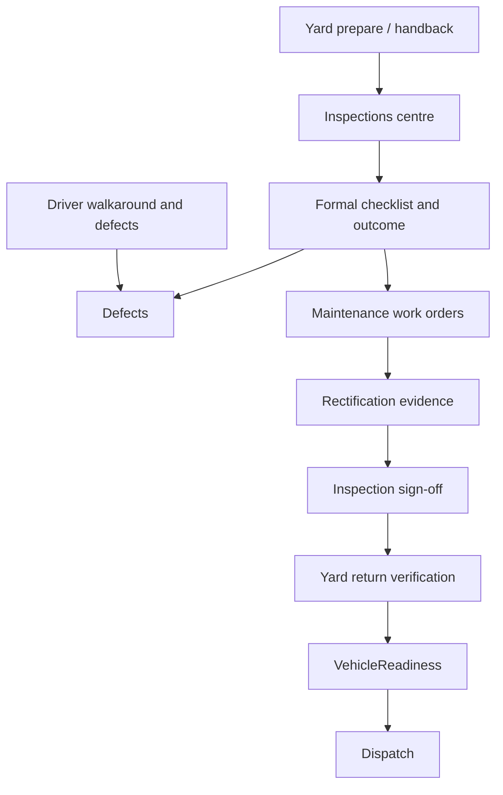

# Admin Inspections control centre (Phase 1)

## Product rule

A vehicle becomes available only when inspection, rectification, evidence and release approvals are complete — never because an appointment passed, a PDF uploaded, a tech marked a repair done, or the vehicle returned to the yard.

## Ownership boundaries

| Domain | Owns |
|--------|------|
| **Inspections** | Formal schedule, booking, checklist, outcome, defect raise, sign-off, next due |
| **Maintenance** | Servicing, diagnosis, WO lifecycle, parts, estimates, workshop execution |
| **Defects** | Individual fault lifecycle (shared records raised from inspection) |
| **Vehicle Checks** | Daily / pre-use walkaround — stays separate |
| **Yard** | Physical prepare, movement, body photos, return verification |
| **Vehicles** | Master record + inspection summary panel |

Formal Safety Inspection (PMI) is an `Inspection` entity that *links* to a Maintenance WO for rectification. The Maintenance PMI tab remains a lens on intervals/WOs; Inspections owns the formal record and sign-off.

## Phase 1 shipped

- Domain: `src/lib/inspections/*` — types, due helpers, sign-off blockers, seed, `buildInspectionsHub`
- Hub tabs: Register · Calendar · Awaiting repair · Providers
- Attention cards + saved views (due week, overdue, awaiting repairs/sign-off, missing brake evidence)
- Detail: workflow timeline, PMI checklist reuse (`COMPANY_PMI_TEMPLATE`), defects, WO links, sign-off panel
- Cross-links: Yard prepare / return, Driver instruction banner, Vehicle Checks tab panel, Maintenance PMI deep-links
- Header: Schedule · Calendar · Import (PDF metadata stub) · Manage schedules → Maintenance PMI
- Mock API: `getInspectionsHub`, `getInspection`, schedule/start/checklist/sign-off/import

## Defer (Phase 2+)

External provider portal, specialist equipment schedules, risk-based interval engine, deep reports/scorecards, versioned DVSA door-safety packs, drag-drop calendar, full body-condition photo engine (Yard remains source of truth).
