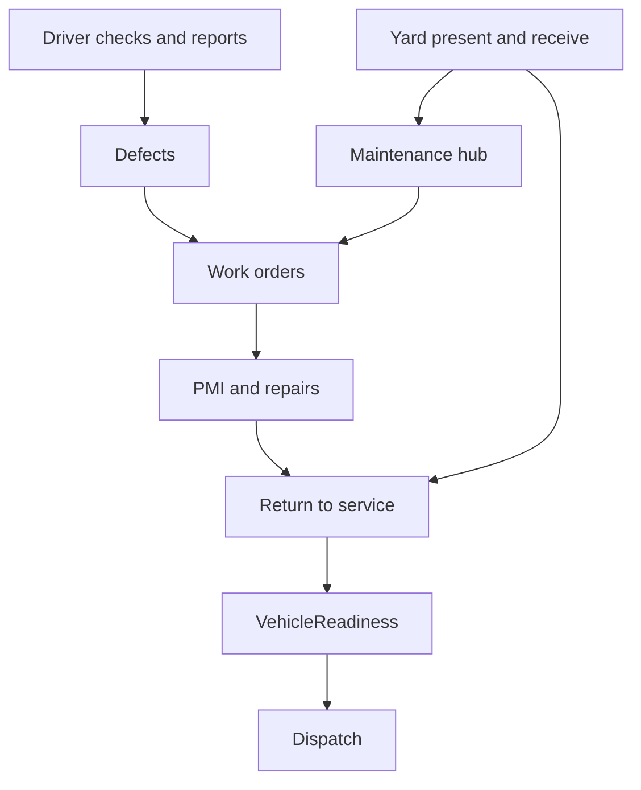

# Maintenance engineering control centre (Phase 1 plan)

## Product rule

A vehicle’s operational availability is calculated from compliance, defects, maintenance, yard and physical-release state. No single status click can make an unsafe vehicle available. Maintenance **orchestrates** work; Vehicles holds master history; Defects owns defect lifecycle; Inspections stores formal evidence; Yard owns physical presentation/return; Dispatch consumes shared readiness.

## Current baseline (do not rebuild)

`MaintenancePage` already has 8 tabs backed by `buildMaintenanceHub()`: Overview (KPI groups + priority board), Work orders, Service schedule, Defects, Calendar, Downtime, Suppliers & parts, Costs. Vehicle detail already has WO lifecycle + RTS checklist. VOR board lives at `/vehicles/vor`.

Phase 1 **reshapes and connects** this shell to match the product brief — not a greenfield rewrite.

## Default scope (Phase 1)

Ship the brief’s **Phase 1 — Core maintenance control** as UI/domain upgrades on the existing hub:

- Overview as operational dashboard (attention-first cards + queue + availability impact)
- Planner (upgrade Calendar + Schedule into Planner tab with list + month views)
- Work orders board (promote existing tab; redirect stub routes)
- PMI interval metadata on vehicle + due/overdue calculation display
- Defect ↔ work-order navigation fixes
- Maintenance-lens VOR board (embed or dedicated tab; reuse VorBoard data)
- Cross-links: `?vehicle=`, Yard prepare/return stubs, Dispatch readiness callout

**Defer (Phase 2+):** digital PMI item forms, technician portal, full parts warehouse, brake-evidence validation engine, cost intelligence depth, predictive maintenance.

## 1. Reshape tabs to brief IA

Update `MAINTENANCE_TABS` to:

| Tab id | Label | Maps from |
|--------|-------|-----------|
| `overview` | Overview | existing |
| `planner` | Planner | merge Calendar + Service schedule |
| `work-orders` | Work Orders | existing |
| `pmi` | PMI & Safety | new lens on schedule/WOs type=`pmi` + interval meta |
| `service` | Service & Statutory | MOT/tacho/service due (existing schedule split) |
| `vor` | VOR Board | new maintenance-lens board |
| `parts` | Parts & Suppliers | existing suppliers tab |
| `costs` | Costs | existing |
| `compliance` | Compliance | new light panel (interval policy + missing evidence queue) |

Redirect `/maintenance/work-orders` → `/maintenance?tab=work-orders`.

## 2. Overview dashboard (attention-first)

Primary strip (clickable filters):

**Due today · Due within 14 days · Overdue (always red) · Vehicles VOR · Open safety-critical defects · In workshop · Awaiting parts · Ready for release**

Panels:

1. **Attention queue** — priority board with recommended action + owner + deadline
2. **Upcoming 30 days** — compact timeline from calendar events (icons + labels)
3. **Fleet availability impact** — available / advisory / workshop / VOR / awaiting release / due soon
4. **Maintenance risk** — repeat defects, missing evidence, high downtime

Header actions: Create work order · Schedule maintenance · Record external work.

Copy: “Plan inspections, control repairs and keep every vehicle roadworthy.”

## 3. PMI interval domain (metadata, not forms)

Store per vehicle:

- `intervalWeeks`, reason, approvedBy/At, reviewDueAt, mileageLimit, next due (earlier of date vs mileage)
- Company default 8 weeks; UI guidance for vehicles ≥12 years → max 6 weeks (DVSA)
- PMI statuses mapped from WO lifecycle — **no** structured digital PMI checklist UI this pass

## 4. Planner

- List view (vehicle, type, next due, days/miles remaining, status, conflict, owner, actions)
- Month view (existing calendar)
- Filters: depot, type, status, due window, overdue, safety-critical
- Duty conflict warning when vehicle has trips in the maintenance window (warn only)

## 5. Work orders + defects wiring

- Fix defect links `tab=work_orders` → `tab=work-orders`
- Honor `?vehicle=` on MaintenancePage
- Show `linkedWorkOrderId` on Maintenance defects rows

## 6. VOR Board (maintenance lens)

Swimlanes: Newly VOR · Awaiting assessment · Awaiting parts · Repair in progress · Re-test · Ready for release.

Release only via existing RTS on vehicle detail — no “make available” shortcut.

## 7. Tests

- Unit: PMI due = min(date, mileage); overdue classification
- E2E: Overview cards, Planner, VOR tab, defect→WO tab param, `?vehicle=` filter

## Out of scope this pass

- Digital PMI forms / technician app
- Full parts warehouse and estimate approval workflows
- Predictive maintenance / supplier scoring
- Replacing Inspections page with Maintenance document archive
- Drag-drop planner or workshop bay assignment

## Implementation todos

1. `maint-ia` — Reshape tabs; redirect stub WO routes ✅
2. `maint-overview` — Attention-first Overview ✅
3. `maint-pmi-planner` — PMI interval metadata + Planner tab ✅
4. `maint-vor-wiring` — VOR board; defect↔WO; `?vehicle=` ✅
5. `maint-docs-tests` — Keep this doc current + unit/e2e ✅

## Phase 1 shipped notes

- Primary tabs: Overview · Planner · Work Orders · PMI & Safety · Service & Statutory · VOR Board · Parts & Suppliers · Costs · Compliance
- Legacy URLs: `schedule`/`calendar`→planner, `suppliers`→parts, `downtime`→costs (+ downtime panel), `work_orders`→work-orders; `defects` still opens the defect register
- `/maintenance/work-orders` redirects into hub with optional `wo` preserve
- Defect deep-links use `tab=work-orders`; defect rows show `linkedWorkOrderId`
- Overview is attention-first; VOR release remains on vehicle RTS only

## Phase 1 closeout (complete)

- Overview **Maintenance risk** panel (clickable into filters / Service / Compliance)
- Planner filters (depot, type, status, due window), owner column, Create WO / Schedule actions
- `VehicleProfile.pmiInterval` persisted metadata; PMI tab uses `resolvePmiInterval` (stored → default)
- Yard stubs: Prepare / Return links open Yard with `?task=` (+ create-task prefill); Dispatch assignment shows shared readiness callout
- Compliance **Missing evidence queue** itemized from PMI quality_check gaps, overdue schedule, approaching MOT/tacho

## Phase 2 programme (sequential)

Work through these slices in order — one focused pass at a time:

| Slice | Focus | Status |
|-------|--------|--------|
| **2a** | Digital PMI checklist forms — structured items + evidence stubs | Done |
| **2b** | Parts warehouse, estimates & supplier approvals | Done (stock + estimate approve) |
| **2c** | Work-order kanban (reuse VOR lane pattern) | Done — board default + table toggle; click Manage for transitions |
| **2d** | Technician portal shell (workshop execution UI) | Done — Maintenance → Technician tab (bay queue + quick actions + PMI) |
| **2e** | Brake-evidence validation + cost intelligence / predictive depth | Done — shared `validateBrakeEvidence`, brake queue slice, cost alerts |

### Phase 2e scope (shipped)

- Shared `validateBrakeEvidence()` used by PMI completion blockers and inspections `hasMissingBrakeEvidence`
- Evidence queue kind `missing_brake_evidence` + Compliance “Brake evidence gaps” panel
- Cost intelligence: fleet avg £/mile, unplanned share %, cost alerts (above avg / high-cost / repeat defects / unplanned-heavy)
- Costs tab renders Cost alerts section

### Phase 2d scope (shipped)

- New **Technician** tab: workshop bay queue + “Assigned to me” filter
- Job execution panel: notes, quick lifecycle actions (start / parts / approval / inspection / complete)
- PMI jobs can open digital checklist inline
- Links to vehicle maintenance, WO kanban, and linked defects
- Shell only — no separate mobile tech app or bay drag-assignment yet

### Phase 2c scope (shipped)

- Coarse lanes: Intake & planning · Workshop · Awaiting parts · Awaiting approval · Ready for inspection
- Default **Board** view on Work Orders tab (VOR-style columns); **Table** toggle retained
- Cards show reg, title, type, status, estimate; **Manage** opens lifecycle transitions + estimate approve/reject
- No drag-drop — status moves only via allowed transitions (same rules as before)
- `?vehicle=` / `?wo=` deep links still work; highlight + auto-open Manage for `?wo=`

### Phase 2a scope

- Company PMI checklist template (PSV/minibus safety inspection sections)
- Instantiate checklist on PMI work orders
- Admin UI to record pass / fail / advisory per item with evidence note / file stub
- Block PMI WO completion until required items + brake evidence are complete
- Evidence queue reads real checklist gaps (not partsCount proxy)
