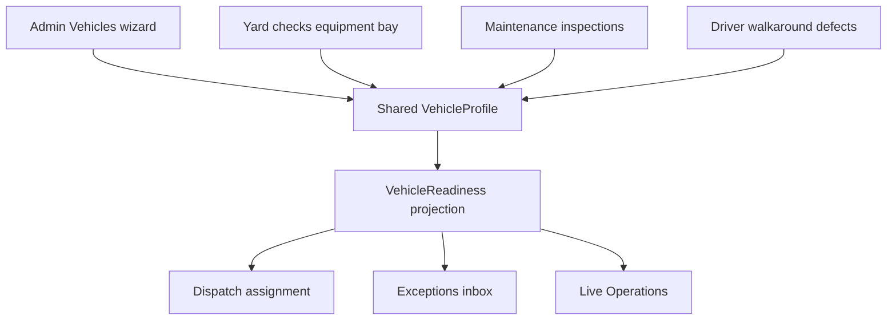

# Veyvio Vehicles — shared master record

## Product rule

One vehicle record, shared by every Veyvio app. Admin defines governance; Maintenance confirms roadworthiness; Yard confirms physical readiness; Driver confirms safety at point of use; Dispatch may assign only when the shared readiness projection says eligible.

## Four status dimensions

Never merge these into a single status pill:

| Dimension | Meaning |
|-----------|---------|
| Lifecycle | Governance state (`awaiting_onboarding`, `active`, sold, …) |
| Operational | Current duty / workshop posture |
| Compliance | Documents and certificates |
| Condition | Open defects, damage, VOR-derived physical state |

Yard readiness (`readinessStatus`: cleaning, fuelling, …) remains a fifth operational signal for depot prep — it is not a substitute for the shared `VehicleReadiness` projection.

## Shared projection

`VehicleReadiness` is calculated in Admin via `syncVehicleProfile` → `evaluateVehicleRelease` → `projectVehicleReadiness`:

- `assignmentEligible` — Dispatch may allocate
- `blockingReasons` / `warningReasons` — human-readable
- `toOpsVehicleReadinessState()` — maps into Control Centre / Live Ops `VehicleReadinessState`

Exceptions inbox vehicle rows consume `readiness.assignmentEligible` and `blockingReasons` (not a second invented answer).

## Admin surfaces (Phase 1)

- **Vehicles register** — six primary KPI cards, multi-status table columns, Import/Export/Bulk stubs
- **Add Vehicle Wizard** — 12 steps at `/vehicles/new` and `/vehicles/:id/onboarding`
- **Edit identity** — `/vehicles/:id/edit` only (no create on the form page)
- **Profile header** — status strip + readiness card with deep links to Yard, Defects, Maintenance, Exceptions

New vehicles remain `lifecycleStatus: awaiting_onboarding` until wizard activation / stage approval — not assignable.

## Ownership of writes

| App | May write |
|-----|-----------|
| Admin | Identity, ownership, compliance docs, eligibility, onboarding approval |
| Yard | Bay/location, equipment, baseline damage, yard readiness |
| Maintenance | Work orders, PMI, VOR RTS |
| Driver | Walkaround defects, point-of-use checks |

No separate Yard/Driver vehicle copies — all update the same `VehicleProfile`.

## Out of scope (later)

- Full DVSA/LOLER field matrix and integrations
- Real Import/Export/Bulk APIs
- Drag-drop body map, QR onboarding hardware, fleet cost intelligence
