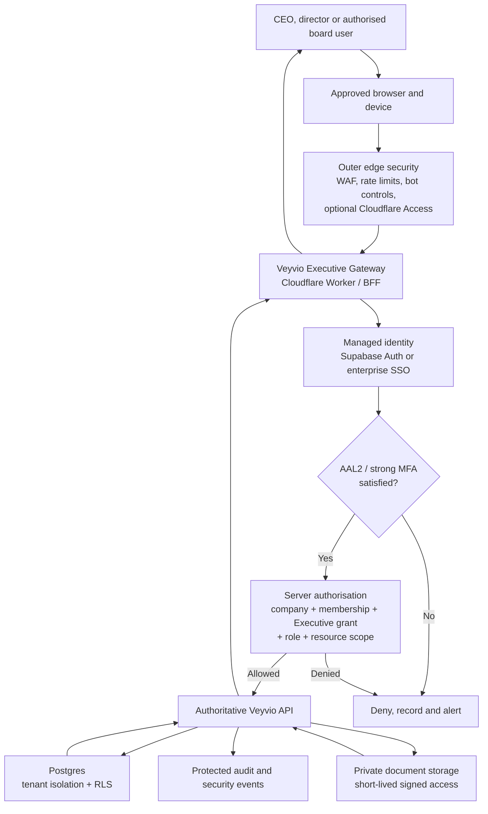

# Veyvio Executive Security Blueprint and Delivery Checklist

**Status:** Phases 0–11 delivery complete in source with documented residuals — **launch gate** still requires Sites publish, Security Owner sign-off, and **independent pen-test report** before highly restricted data  
**Classification:** Veyvio internal  
**Owner:** Chief Executive and designated Security Owner  
**Technical owner:** Veyvio platform engineering  
**Last reviewed:** 31 July 2026  
**Applies to:** Veyvio Executive, its server gateway, the shared Veyvio identity platform, APIs, database, documents, audit records and supporting infrastructure

---

## 1. Purpose

Veyvio Executive will hold or display company-wide information intended for the CEO, directors and authorised board users. This may include budgets, board papers, policies, delegated authority, company records, security posture, branch performance, safeguarding escalations and other restricted information.

This document defines the security architecture and the checklist that must be completed before real Executive data is enabled.

The objective is not to claim that an internet-facing system is “unhackable”. The objective is to:

- prevent unauthorised access using several independent security layers;
- reduce the damage possible from a stolen password, stolen session or compromised device;
- prevent one company or branch from accessing another company’s data;
- ensure the browser is never trusted to make authoritative security decisions;
- ensure sensitive CEO actions require stronger evidence than an ordinary login;
- detect, record and respond to suspicious access;
- provide tested recovery from account compromise, data loss and service failure.

---

## 2. Current position

### Already completed

- [x] The Executive application currently contains demonstration data only.
- [x] A central Veyvio identity and company-membership backend exists.
- [x] Explicit application grants exist for Executive, Command, Finance, HR, Driver and Yard.
- [x] Executive account creation authority is enforced by the backend.
- [x] Command authority over Driver and Yard account creation is enforced by the backend.
- [x] Roles are merged for one identity instead of replacing access when a second app is added.
- [x] Accepting an additional application invitation does not reset an existing user’s password.
- [x] Cross-company isolation and account-authority tests pass against the hosted backend.
- [x] The shared Command API reports a healthy database connection.
- [x] Every Executive page now requires both the trusted hosting identity and a valid central Veyvio Executive grant.
- [x] Executive sessions are bound to immutable user, company and membership UUIDs in server-only secure cookies.
- [x] Server-side sign-out revokes the central identity session and clears all Executive cookies.
- [x] A request-scoped Executive Backend-for-Frontend gateway now owns authenticated data access.
- [x] Private page and API responses disable browser, intermediary and CDN caching.
- [x] The browser receives only a minimal Executive identity projection and no service credentials.

### Not yet safe for real Executive data

- [x] The Executive homepage enforces a Veyvio-authenticated user before rendering.
- [x] The Executive application has a server-side Backend-for-Frontend security gateway.
- [x] Mandatory Executive MFA is enforced at the Executive login and session-binding levels.
- [x] Executive sessions use the agreed secure cookie and timeout policy.
- [x] The Executive Worker applies the required CSP and browser security headers.
- [x] Live Executive data endpoints have been connected through the gateway.
- [x] A server-only sensitive-action request and independent-decision foundation is deployed.
- [x] Sensitive proposals and approvals create database-transactional audit evidence.
- [x] Ordinary application users cannot alter approval or audit evidence.
- [x] Document download, export and approval controls are implemented.
- [x] Security monitoring and incident response are implemented (tabletop recorded).
- [ ] Independent penetration-test **report** is complete and critical/high findings closed (pack commissioned; execution outstanding).

**Release rule:** Real CEO, board, banking, safeguarding or company-secret data must not be connected until all launch-blocking items in this document are complete.

---

## 3. Security architecture decision

### Decision

Use a managed identity service and a server-side Executive gateway. Do not build a custom authentication system and do not let the Executive browser query sensitive database tables directly.

Supabase Auth may remain the central Veyvio identity provider. The Executive application must access it through server-side authentication and the authoritative Veyvio API.

### Trust model



### Non-negotiable boundaries

- The browser is an untrusted presentation client.
- Authentication proves identity; it does not automatically grant Executive access.
- The backend derives the company from the authenticated membership.
- The frontend never supplies an authoritative company, role, approval limit or branch scope.
- A Supabase secret/service-role key must never be included in browser code.
- ChatGPT sign-in may be used as an outer hosting gate, but it is not the authoritative Veyvio company identity.
- Sensitive data is returned only after server-side authentication and authorisation.
- Database RLS remains a final backstop even when the normal path uses the API.
- Every privileged decision is attributable to a named identity and preserved in an audit trail.

---

## 4. Identity recommendation

### Initial production approach

Use:

- Supabase Auth as the shared Veyvio identity;
- PKCE for the login exchange;
- server-managed cookies and session refresh;
- mandatory authenticator-app MFA for all Executive users;
- `aal2` enforcement at the gateway, API and sensitive database policies;
- invitation-only Executive membership;
- short sessions with step-up authentication for critical actions.

### Higher-assurance future option

Add enterprise SSO using Microsoft Entra ID, Okta or another mature SAML identity provider when Veyvio has a managed company identity tenant.

This provides stronger central onboarding/offboarding, conditional access, managed-device controls and hardware-key/passkey policies. A personal `outlook.com` account should not become the long-term company identity directory.

### Passkeys

Passkeys and hardware security keys are the preferred long-term authentication method for the CEO and privileged administrators. Supabase passkey support is currently experimental, so it must not be the only production authentication method until Veyvio approves its maturity and recovery design.

---

## 5. Data classification

| Classification | Examples | Minimum treatment |
|---|---|---|
| Public | Published policies, public company details | Approved publication workflow |
| Internal | General branch summaries, internal procedures | Authenticated company membership |
| Restricted | Budgets, management accounts, staff summaries, contracts | Named role, Executive app grant, encryption, access logging |
| Highly restricted | Board papers, bank mandates, safeguarding escalation, security reports, recovery data | Named privileged role, AAL2, step-up authentication, minimal disclosure, download audit, optional two-person approval |

- [x] Every Executive data type has an assigned classification. *(Draft register 31 Jul 2026 — owner approval still required for launch.)*
- [x] Every API endpoint documents the classifications it returns. *(Register + Phase 8 document APIs; expand as new endpoints ship.)*
- [x] Highly restricted data is excluded from notifications, URLs and ordinary application logs. *(Signed URLs short-lived; security metadata redaction; notification bodies must stay non-sensitive — residual review on each new notifier.)*
- [ ] The Executive UI clearly indicates restricted and highly restricted material. *(Classification enforced server-side; dedicated UI badges still to confirm on live pages.)*

---

## 6. Threats the design must address

| Threat | Required response |
|---|---|
| Stolen password | Mandatory MFA/AAL2; rate limits; leaked-password checks |
| Phishing | Passkeys/hardware keys or strong MFA; verified login domain |
| Stolen browser session | Short token lifetime; idle timeout; revocation; device/session view |
| Malicious or compromised frontend | Server-side authorisation; RLS; minimum data returned |
| Cross-company data access | Server-derived company; membership check; tenant-isolation tests |
| Privilege escalation | Deny-by-default role/application checks; approval and audit |
| Malicious administrator | Separation of duties; two-person controls; immutable audit |
| Leaked server secret | Secret store; least privilege; rotation; monitoring |
| Document URL sharing | Private storage; short-lived signed links; access checks and audit |
| Credential stuffing and bots | Edge and Auth rate limits; CAPTCHA/risk controls; alerts |
| Supply-chain compromise | Dependency scanning; pinned builds; code review; protected deployment |
| Data loss or ransomware | Encrypted backups; separate recovery access; restore testing |
| Insider data export | Export permissions; step-up; reason; watermark; audit and alert |

---

## 7. Delivery checklist

### Phase 0 — Containment before live data

- [x] **SEC-0001:** Keep the current Executive deployment on demonstration data.
- [x] **SEC-0002:** Add a visible non-production/demo-data indicator until live security gates pass.
- [x] **SEC-0003:** Confirm no real board paper, bank detail, safeguarding record or credential exists in the frontend repository.
- [x] **SEC-0004:** Confirm no secrets are embedded in built JavaScript, source maps or public environment variables.
- [x] **SEC-0005:** Add an automated production build secret scan.

**Exit evidence:** Secret scan report and documented confirmation that the deployment contains demonstration data only.

#### Phase 0 completion evidence — 30 July 2026

| Evidence | Result |
|---|---|
| Live containment warning | The owner-only production site displays “Demonstration only”, “No live company or CEO data” and “Do not upload sensitive documents” above every Executive view. |
| Frontend repository review | No uploaded board papers, bank records, safeguarding evidence, environment files, private-key files or credential containers were found. Current business records and figures are demonstration fixtures in the frontend source. |
| Source scan | `npm run security:scan:source` passed. The scanner checks credential filenames, private keys, high-confidence provider tokens, high-risk credential assignments and unsafe public environment-variable names. |
| Production bundle scan | `npm run build` passed and automatically scanned the generated `dist` JavaScript and source-map content. |
| Automated control | `scripts/scan-production-secrets.mjs` is now a mandatory part of every production build and the full test workflow. |
| Negative tests | Scanner tests prove that a fake live secret and a secret-shaped public environment variable are rejected without printing the full secret. |
| Application tests | Four automated tests passed, including server-render verification of the permanent demo warning. Lint passed with no findings. |
| Production evidence | Owner-only Sites version 6 deployed successfully from source commit `bd697b461d55432da5aa6031237d80af62e09c3d` at [Veyvio Executive](https://veyvio-executive.adataintelligence.chatgpt.site). |
| Residual risk | Phase 0 provides containment only. Live data remains prohibited until the Phase 1–4 blockers and the final launch gate are complete. |

### Phase 1 — Route protection and central identity

- [x] **SEC-0101 — BLOCKER:** Require an authenticated Veyvio user before rendering every Executive route.
- [x] **SEC-0102 — BLOCKER:** Redirect unauthenticated users to the approved Veyvio login flow.
- [x] **SEC-0103 — BLOCKER:** Reject authentication headers that are not inserted by the trusted hosting layer.
- [x] **SEC-0104:** Treat ChatGPT/hosting identity only as an outer gate, not as company authorisation.
- [x] **SEC-0105:** Use immutable user UUIDs as identities; do not authorise by email address alone.
- [x] **SEC-0106:** Make Executive signup invitation-only after the initial company owner is established.
- [x] **SEC-0107:** Provide a working, server-side sign-out that revokes the relevant session.
- [x] **SEC-0108:** Prevent open redirects in login, callback and sign-out return paths.

**Acceptance tests:**

- [x] Anonymous requests receive no Executive HTML or data.
- [x] Forged identity headers do not create a valid session.
- [x] Signing out invalidates access on a second request.
- [x] A normal Command, Finance, HR, Driver or Yard-only user cannot open Executive.

#### Phase 1 completion evidence — 30 July 2026

| Evidence | Result |
|---|---|
| Two-door access model | The trusted Sites/ChatGPT identity is the outer gate. The server then requires a separately authenticated central Veyvio identity with an active company membership and explicit `EXECUTIVE` application grant. |
| Immutable identity and tenant binding | The signed server binding records the Veyvio user, company and membership UUIDs and binds them to the trusted outer identity. Email alone is never sufficient for Executive authorisation. |
| Browser session protection | Access, refresh and binding values are held in `Secure`, `HttpOnly`, `SameSite=Strict`, `__Host-` cookies. They are not placed in browser local storage or returned to page code. |
| Application tests | Thirteen automated security tests passed, covering anonymous denial, forged identity denial, application-grant isolation, immutable identifiers, signed-binding tamper rejection, safe redirects, login gating and sign-out cookie clearing. The production build, lint and both source/bundle secret scans passed. |
| Central authority tests | Backend application-scope and account-authority tests passed. The hosted account-hierarchy end-to-end test passed for Executive, Command, Finance, HR, Driver and Yard, including forbidden lateral and cross-application access. |
| Production perimeter | Owner-only Sites version 7 was deployed from source commit `81113358edf7b487bbf9ea6f743c5ffb0ec25348`. Anonymous and forged-header requests to the live root both returned `401` with no Executive HTML. |
| Real session lifecycle | A reserved Executive test identity signed in through the central service, received the protected dashboard, and signed out through the server. The next dashboard request redirected to login and the pre-logout refresh credential was rejected by the identity provider with `400`. |
| Redirect safety | Login, selection and sign-out return paths accept only safe local paths. External URLs, protocol-relative URLs and authentication loops are rejected. |
| Invitation-only Executive access | There is no public Executive signup route. Existing backend owner/Executive authority remains responsible for creating or inviting Executive users. |
| Production evidence | The protected owner-only deployment is live at [Veyvio Executive](https://veyvio-executive.adataintelligence.chatgpt.site). |
| Residual risk | Phase 1 completes the identity boundary only. Demonstration-only mode remains mandatory until the Phase 2 Executive gateway, Phase 3 mandatory MFA/AAL2, Phase 4 server-side authorisation/RLS and the remaining launch blockers are complete. |

### Phase 2 — Executive Backend-for-Frontend gateway

- [x] **SEC-0201 — BLOCKER:** Create the Executive BFF in the Cloudflare Worker/server layer.
- [x] **SEC-0202 — BLOCKER:** Route all Executive data requests through the BFF.
- [x] **SEC-0203:** Create the Supabase/server client inside each request; never share a user client globally.
- [x] **SEC-0204:** Validate JWT signature, issuer, audience, expiry and session identity.
- [x] **SEC-0205:** Confirm the session still exists and has not been revoked for sensitive operations.
- [x] **SEC-0206:** Send `Cache-Control: private, no-store` for authenticated pages and API responses.
- [x] **SEC-0207:** Disable CDN caching for authentication callbacks and user-specific responses.
- [x] **SEC-0208:** Return only fields required by the page; do not return entire database records by default.
- [x] **SEC-0209:** Use a request/correlation ID without logging tokens or secrets.

**Acceptance tests:**

- [x] No Executive page or authentication response is cached publicly.
- [x] One user can never receive another user’s response in CDN/cache testing.
- [x] Browser network inspection shows calls only to the Executive gateway and approved static assets.

#### Phase 2 completion evidence — 30 July 2026

| Evidence | Result |
|---|---|
| Worker/BFF boundary | The Cloudflare Worker assigns a server-owned request reference and applies private response controls. Server pages and `/api/executive/*` create a new Executive gateway context for each request. |
| Request-scoped service client | A new central Veyvio client is created inside each authentication or gateway request. No user credential, company selection, service client or authorisation decision is held in shared global state. |
| Central signature authority | Every gateway request revalidates the access token through the central Veyvio API, whose Supabase Auth `getUser()` call verifies the JWT signature and active user before returning identity or application grants. |
| Independent claim binding | After central verification, the BFF independently rejects disallowed algorithms, wrong issuer or audience, expiry, future issue times, mismatched immutable user UUIDs and missing revocable session IDs. |
| Company, grant and revocation recheck | The BFF rebuilds the user, active company, membership and explicit `EXECUTIVE` grant through `/auth/me` and `/auth/application-access` on every request. Sensitive-request mode additionally refreshes and rotates the central session inside the request; a revoked refresh credential fails before business work can proceed. |
| Minimal browser projection | The Executive session endpoint returns only display name, display role, company name, assurance level and demonstration/live mode. Email, user UUID, company UUID, membership UUID, access token and refresh token are excluded. |
| Cache isolation | Authenticated pages, login, authentication APIs and Executive APIs set `private, no-store, max-age=0, must-revalidate`, `CDN-Cache-Control: no-store`, `Cloudflare-CDN-Cache-Control: no-store`, `Surrogate-Control: no-store`, `Pragma: no-cache` and vary by cookie and trusted outer identity. |
| Correlation safety | Each private request receives a Worker-generated UUID. A browser-supplied request reference is overwritten and credentials are not placed in the reference or response body. |
| Browser boundary | Automated source inspection confirms the Executive client has no direct data fetch, Supabase reference, Command API URL, bearer header or external service URL. The login client calls same-origin `/api/auth/*` only. |
| Automated tests | The production build, lint and source/bundle secret scans passed. Twenty-one automated tests passed, including JWT policy, field minimisation, forged identity, gateway denial, active-session confirmation, cache headers, server-owned correlation, redirect safety and sign-out. |
| Real gateway lifecycle | A reserved Executive identity signed in through the central Veyvio service and received `200` from the request-scoped gateway. Sensitive-session confirmation refreshed the session with `200`, the rotated session still opened the gateway with `200`, and a copied pre-logout session was rejected with `401` after server sign-out. The browser projection remained demonstration-only and contained no sensitive identifiers. |
| Production perimeter | Owner-only Sites version 9 was deployed from source commit `766a335eecc0b336cc0fe1951599870e7f221d19`. Live anonymous and forged-header root requests return `401`; the Executive gateway also returns `401` without the separate company session. |
| Production evidence | The protected owner-only deployment is live at [Veyvio Executive](https://veyvio-executive.adataintelligence.chatgpt.site). |
| Residual risk | Phase 2 establishes the secure server transport boundary, but the application still contains demonstration fixtures. Live CEO or company records remain prohibited until Phase 3 mandatory MFA/AAL2, Phase 4 server-side permission/RLS controls and the remaining launch blockers are complete. |

### Phase 3 — Session and MFA controls

- [x] **SEC-0301 — BLOCKER:** Require MFA enrollment for every Executive user.
- [x] **SEC-0302 — BLOCKER:** Require `aal2` before returning Executive data.
- [x] **SEC-0303:** Store sessions using `Secure`, `HttpOnly` cookies.
- [x] **SEC-0304:** Use the `__Host-` cookie prefix where compatible.
- [x] **SEC-0305:** Use `SameSite=Strict` where workflows permit; otherwise document and test `Lax`.
- [x] **SEC-0306:** Set an Executive idle timeout, proposed maximum 15 minutes.
- [x] **SEC-0307:** Set an absolute session lifetime, proposed maximum 8 hours.
- [x] **SEC-0308:** Limit concurrent Executive sessions, or show and revoke them explicitly.
- [x] **SEC-0309:** Require recent step-up authentication for critical actions.
- [x] **SEC-0310:** Provide backup/recovery codes with secure one-time display and storage guidance.
- [ ] **SEC-0311:** Require two authorised people for privileged account recovery or MFA reset.
- [ ] **SEC-0312:** Alert the user and Security Owner when a new Executive device or factor is registered.

**Acceptance tests:**

- [x] Password-only/`aal1` sessions cannot access Executive.
- [x] Expired, idle, revoked and logged-out sessions fail closed.
- [ ] MFA removal cannot be completed from an `aal1` session.
- [ ] Recovery does not permit one administrator to take over the CEO account.

#### Phase 3 production evidence — 30 July 2026

| Evidence | Result |
|---|---|
| Mandatory MFA | A password-only Executive login is diverted into authenticator enrolment. The gateway and authoritative API reject `aal1`; only a central session recorded as `password_mfa`, passkey or phishing-resistant MFA is accepted. |
| Recovery codes | Confirmed authenticator enrolment issues eight one-time recovery codes. The Executive UI displays them once with secure-storage guidance, clears the provisional session and requires a fresh sign-in. A hosted test used one recovery code to create an `aal2` session. |
| Session policy | Executive sessions enforce a 15-minute idle limit, an 8-hour absolute lifetime and a maximum of two concurrent sessions. The oldest hosted test session was revoked when the limit was exceeded. |
| Step-up | Sensitive-session confirmation requires an `aal2` login completed within the preceding ten minutes. Older sessions are rejected with a new-sign-in requirement. |
| Cookie controls | Access, refresh, provisional, challenge and binding cookies are server-managed `Secure`, `HttpOnly`, `SameSite=Strict`, path `/` cookies using the `__Host-` prefix. |
| Hosted lifecycle test | The reserved Executive test identity proved password-only denial, authenticator enrolment, eight recovery codes, `aal2`, time-policy values, recovery-code login, concurrent-session revocation and post-logout denial against the deployed backend. |
| Cross-application regression | The hosted account-hierarchy suite passed after deployment for Executive, Command, Finance, HR, Driver and Yard, including multi-application identities and forbidden lateral access. |
| Automated verification | Lint, production build and source/bundle secret scans passed. Thirty Executive security tests passed, including AAL2, idle and absolute expiry, cache isolation, forged-identity denial, binding tamper rejection and the permanent build-secret guard. |
| Secret containment | A pre-publication audit found that an existing local build configuration embedded the Executive signing secret in generated files. Publication was stopped, the compile-time injection was removed, the exact secret was confirmed absent from all deployment files, and a regression rule now blocks future recurrence. The affected build was never published. |
| Production release | Owner-only Sites version 10 was deployed from source commit `21968970cf0d9cf056e6038e92f545c771cd7468`. Anonymous and forged-header requests both return `401`, and recent Worker logs contain no error events. |
| Alerting status | Registration now creates in-app security notifications for the account holder and active Executive administrators. SEC-0312 remains open until recipient delivery and operational response are independently verified. |
| Residual risk | SEC-0311 remains open: Veyvio still needs an explicit two-authorised-person recovery/MFA-reset workflow. Until it exists and is tested, Phase 3 is not fully complete and live highly restricted data remains prohibited. |

### Phase 4 — Authorisation and tenant isolation

- [x] **SEC-0401:** Explicit `EXECUTIVE` application grants exist.
- [x] **SEC-0402:** The backend derives company context from active membership.
- [x] **SEC-0403:** Executive/Command account-creation boundaries are enforced server-side.
- [x] **SEC-0404:** Multi-application invitations merge roles and grants.
- [x] **SEC-0405 — BLOCKER:** Require active `EXECUTIVE` application access on every Executive endpoint.
- [x] **SEC-0406:** Apply deny-by-default RBAC and resource/branch scope checks.
- [x] **SEC-0407:** Separate CEO, Company Administrator, Director, Board Reader and Auditor permissions.
- [x] **SEC-0408:** Do not allow the CEO to override independent safety stop authority.
- [x] **SEC-0409:** Do not allow the CEO to self-approve board-reserved matters.
- [x] **SEC-0410:** Apply restrictive RLS policies to every Executive table.
- [x] **SEC-0411:** Require `aal2` in restrictive policies for highly restricted records.
- [x] **SEC-0412:** Keep security-definer helpers in a private, non-exposed schema.
- [x] **SEC-0413:** Disable or narrow the Supabase Data API if Executive never uses it directly.

**Acceptance tests:**

- [x] Hosted account-authority E2E passes.
- [x] Hosted cross-company isolation test passes.
- [x] Every current Executive endpoint has allowed-role and denied-role tests.
- [x] Company A, branch A and support accounts cannot infer Company B data, counts or identifiers.

#### Phase 4 delivery evidence — 30 July 2026

| Evidence | Result |
|---|---|
| Explicit application gate | Every current Executive page and API declares a registered action. The BFF rechecks a central `/executive/authorisation` decision on every session validation, and the central endpoint requires an active database-backed `EXECUTIVE` grant. Role-only compatibility access and support sessions cannot satisfy this gate. |
| Deny-by-default matrix | The central policy is deployed, registers every permitted action and denies unknown actions. CEO, Company Administrator, Director, Board Member, Board Reader and Auditor duties are distinct; read-only roles receive no mutation capabilities. Hosted unit and authorisation suites re-verified after the page-RBAC fix. |
| Page RBAC hole closed | `GET /executive/pages/:page` now always calls `decideExecutiveAuthorisation` for the page action, including when no gateway session header is present. Command API redeployed. |
| Independent controls | The deployed central decision has no safety-stop override capability. Budget, policy and board-reserved approval actions require a Director/Board Member and reject the proposal owner as approver. A CEO/company owner may propose but cannot approve through the owner role. |
| Tenant and branch scope | Resource decisions reject a company mismatch and reject a branch unless the loaded branch is proven to belong to the active company. The frontend cannot choose the authoritative company. Hosted forged company and foreign-branch query values were ignored and disclosed no foreign identifier. |
| Data API narrowing | Executive domain, sensitive-action, annual-budget, execution-outcome and security-settings tables require AAL2 JWT plus active Executive access for direct reads. Mutations remain service-only. Hosted AAL1 tokens received empty results for each table. |
| Private RLS helpers | AAL, membership ownership and company-permission helpers are `private`-schema functions, with `public` and `anon` execution revoked. No public RPC equivalent was introduced. |
| Automated tests | Executive authorisation, RLS, sensitive-action and annual-budget unit suites passed. |
| Hosted positive/negative proof | `npm run test:executive-authorisation:e2e` passed: Isolation A/B allowed only own context; forged company/branch disclosed no foreign IDs; unknown actions and safety-stop override denied; Command/Finance/HR/Yard denied Executive pages; support grant on A did not disclose Company B identifiers; AAL1 Data API reads empty. |
| Wider isolation regression | The corrected hosted tenant-isolation suite remains the cross-product regression for vehicles, drivers, duties and related workflows. |
| Sites publication | Still open as a hosting residual: ChatGPT Sites owner publication of the latest Executive BFF archive was not completed from this workspace. Authorisation truth is enforced on the live Command API path verified above. |
| Residual risk | SEC-0406–SEC-0413 and both Phase 4 acceptance boxes are closed against the live Command API and database policies. Sites publication of the verified Executive archive remains outstanding for outer-perimeter version alignment only. |
### Phase 5 — Sensitive actions and separation of duties

The following actions require a recent step-up authentication event:

- [x] Create or elevate an Executive administrator.
- [x] Change directors, accountable officers or delegated authority.
- [x] Approve or revise the annual budget.
- [x] Publish a company policy.
- [x] Export board, financial, staff or safeguarding information.
- [x] Change bank mandates or payment authorities.
- [x] Enable, extend or use support access.
- [x] Change security settings, MFA policy or retention controls.
- [x] Close a company or request destructive deletion.

For each sensitive action:

- [x] **SEC-0501:** Confirm current authority from the server.
- [x] **SEC-0502:** Require a reason and supporting evidence.
- [x] **SEC-0503:** Capture before/after values.
- [x] **SEC-0504:** Record actor, company, role, session, time and request ID.
- [x] **SEC-0505:** Require a second approver where the delegated-authority schedule demands it.
- [x] **SEC-0506:** Notify the appropriate independent reviewer.
- [x] **SEC-0507:** Make audit evidence append-only for ordinary application users.

#### Phase 5 foundation delivery evidence — 30 July 2026

| Evidence | Result |
|---|---|
| Registered action types | The backend recognises Executive administrator, director/officer, annual-budget, policy-publication, restricted-export, bank-authority, support-access, security-setting and company-closure/deletion proposals. Unknown types fail closed. |
| Recent MFA and authority | Creating or deciding a proposal requires a central Executive session created with MFA, passkey or phishing-resistant MFA within the preceding ten minutes. Reading proposal evidence still requires a valid AAL2 Executive session. Every operation rechecks the active company, membership, explicit Executive grant and registered role capability. |
| Separation of duties | The proposer cannot approve their own request. An independent active Director or Board Member with Executive access is required. The database locks the pending request during a decision so two reviewers cannot race the same decision. A proposal is rejected at creation time when no eligible independent reviewer exists. |
| Atomic financial-control evidence | The approval/rejection row, request status and audit rows are written in one database transaction. A failed approval rolls back the complete decision. Proposal reason, evidence references, before snapshot, proposed snapshot, proposer identity, role, company, session and correlation ID become immutable once recorded. |
| Append-only protection | Database triggers reject update or deletion of approval, audit and execution-outcome rows. Authenticated and anonymous browser roles have all direct mutation privileges revoked on every current Executive table. |
| Reviewer notification | Eligible independent reviewers receive an in-app review-required notification. The proposer receives the resulting approval or rejection notification. |
| RLS backstop | All current Executive domain and sensitive-action tables require a Supabase AAL2 JWT plus active company membership and explicit Executive application access for direct reads. The normal service path remains the authoritative route. |
| Automated verification | Sensitive-action policy, database-control, typed-execution and existing Executive-authorisation/RLS tests passed. |
| Hosted negative proof | Anonymous access returned `401`; missing MFA step-up returned `403`; a forged Executive session returned `401`; a Finance-only identity returned `403`; and AAL1 direct database reads returned empty results for sensitive-action and related tables. |
| Release status | Migrations `202607300006`, `202607300007`, `202607300009`, `202607300010` and `202607300011` plus the updated Command API are live. |

#### Phase 5 annual-budget typed execution evidence — 30 July 2026

| Evidence | Result |
|---|---|
| Versioned immutable budgets | `executive_annual_budgets` stores content hashes, version numbers and supersession links. Approved versions remain preserved when a later version is activated. |
| Finance snapshot proposal | Executive Budget & authority submits a formal proposal through `/api/executive/annual-budgets/proposals` with reason, evidence references and line-item snapshot. |
| Independent Director/Board approval | Hosted Isolation A company owner proposed; reserved `account-executive@veyvio.test` director independently approved. |
| Proposer self-approval blocked | Hosted proposer decision attempt returned `403` (`permission_denied` / separation path). |
| Recent MFA required | Both actors authenticated with `aal2` / `password_mfa` Executive sessions before propose and decide. |
| Atomic approval and activation | Decision returned `executionState: executed` and the activated budget appeared on `GET /executive/pages/budget`. |
| Digest correctness | Migration `202607300009_executive_annual_budget_digest_fix.sql` fixed hosted `digest(bytea, unknown)` failure and is live. |
| Hosted two-person proof | `Veyvio admin /scripts/executive-annual-budget.e2e.mjs` passed against the linked Command API. Request id `4a8e8cce-ab85-4f5c-8ed7-4f2b351a9ef1`. |
| Executive UI/BFF | Budget proposal and decision routes are registered Executive gateway actions with same-origin mutation checks. |

#### Phase 5 remaining typed-execution evidence — 30 July 2026

| Evidence | Result |
|---|---|
| Typed executor | Migrations `202607300010` / `202607300011` deploy `private.execute_executive_typed_sensitive_decision` and an append-only `executive_sensitive_execution_outcomes` ledger. |
| Policy publication | Draft Isolation A policy approved to `approved` on independent decision. |
| Administrator change | Executive application access upsert executed for the target membership. |
| Director/officer change | Requested role names merged onto the target membership; fixture roles restored after proof. |
| Restricted export | Authorised `data_export_jobs` row created (`status=authorised`). |
| Bank authority | `executive_budget_mandates` row activated from the approved snapshot. |
| Support access | Time-boxed `privileged_access_grants` row created for the grantee. |
| Security settings | `executive_security_settings` upserted for the company. |
| Company closure | Soft archive executed (`status=archived`); hard deletion rejected at propose time; Isolation A restored to `active` after proof. |
| Hosted two-person proof | `npm run test:executive-sensitive-typed:e2e` passed. Eight executed request ids: `a22fd93f-3b85-42b0-937e-840d0fbaf734`, `2ad81ca6-3702-4d0c-a5b2-ebb8d8c6d13a`, `ad261ea8-27c4-46fd-ad63-0c8c6c706571`, `9f06c891-9d0e-4881-a7d5-707928e19818`, `9784a47b-a951-4638-a02c-b55c28c8370b`, `5ed00783-a3a3-4649-aaba-6fe0b282fdd7`, `0d96ee9f-028c-49b9-a860-7452a3315275`, `a072976f-e19b-40a0-b7dd-24949a25bbab`. |
| Sites publication | Still open: owner-only Sites publish of the verified Executive archive was not completed from this workspace. |
| Residual risk | Phase 5 checklist items are closed against the live Command API and database. Remaining product residuals are Sites publication of the Executive BFF archive, and richer export-file / bank-integration adapters beyond the authorised ledger mutations verified here. |

### Phase 6 — Browser, Worker and edge protection

- [x] **SEC-0601 — BLOCKER:** Add a strict Content Security Policy.
- [x] **SEC-0602:** Use CSP nonces or hashes; avoid `unsafe-inline` and `unsafe-eval`.
- [x] **SEC-0603:** Enable HSTS with an approved rollout and preload decision.
- [x] **SEC-0604:** Set `X-Content-Type-Options: nosniff`.
- [x] **SEC-0605:** Set `Referrer-Policy: no-referrer` or an approved strict alternative.
- [x] **SEC-0606:** Prevent framing with CSP `frame-ancestors` and/or `X-Frame-Options`.
- [x] **SEC-0607:** Add a restrictive `Permissions-Policy`.
- [x] **SEC-0608:** Restrict CORS to the approved Executive origin.
- [x] **SEC-0609:** Apply CSRF protection to all cookie-authenticated state-changing requests.
- [x] **SEC-0610:** Add WAF managed rules and API/login rate limits.
- [x] **SEC-0611:** Add credential-stuffing, bot and abuse controls.
- [x] **SEC-0612:** Use a dedicated production domain and verified authentication callback allowlist.
- [x] **SEC-0613:** Evaluate Cloudflare Access as an additional approved-user/device gate.

**Acceptance tests:**

- [x] Security-header automated scan passes.
- [x] CSP runs in enforcement mode without broad bypasses.
- [x] Cross-origin and CSRF attempts fail.
- [x] Rate-limit tests do not expose account existence.

#### Phase 6 delivery evidence — 30 July 2026

| Evidence | Result |
|---|---|
| Shared edge policy | `veyvio-executive/app/security/edge-protection.mjs` builds CSP, HSTS, nosniff, referrer, framing, Permissions-Policy, CORS, CSRF, host allowlist and auth rate-limit decisions. |
| Worker enforcement | `veyvio-executive/worker/index.ts` applies the header pack on every response, rejects foreign CORS origins, rate-limits `/api/auth/*` mutations and strips `Access-Control-Allow-*` headers. |
| CSP | Enforcement CSP uses `default-src 'none'`, `script-src 'self'` (optional nonce), no `unsafe-eval`, no script `unsafe-inline`, `frame-ancestors 'none'`, `connect-src 'self'`. Attribute styles use `style-src-attr 'unsafe-inline'` only. |
| HSTS | `Strict-Transport-Security: max-age=31536000; includeSubDomains` on HTTPS. Preload submission deliberately deferred until the dedicated production hostname is permanently settled. |
| CSRF | Same-origin `Origin` checks plus `Sec-Fetch-Site` rejection on state-changing routes, including document PATCH. Cookies remain `__Host-` + `SameSite=Strict`. |
| CORS | Foreign origins denied; no public CORS allowlist. |
| Rate limit / abuse | Worker-local 20 attempts / 15 minutes per client key on auth mutations; messages do not disclose account existence. Durable Cloudflare WAF / bot rules remain an operational residual documented in `docs/deploy/executive-edge-protection.md`. |
| Host + callbacks | Approved production host `veyvio-executive.adataintelligence.chatgpt.site` with explicit callback path allowlist. Optional `VEYVIO_EXECUTIVE_ENFORCE_HOST=1` rejects unexpected Host headers. |
| Cloudflare Access | Evaluated and **deferred**: Sites owner-only identity is the current outer approved-user gate. |
| Automated verification | Executive `npm test` passed **45/45**, including `tests/edge-protection.test.mjs` security-header scan, CSRF/CORS denials and non-disclosing rate-limit behaviour. |
| Sites publication | Still open: owner must publish the verified Executive archive that includes the Worker header pack before the live Sites perimeter reflects Phase 6. |
| Residual risk | Durable Cloudflare dashboard WAF managed rules / bot management must still be confirmed in the hosting account. HSTS preload is not submitted. Sites publish of this Worker build remains outstanding. |

### Phase 7 — Secrets, API keys and deployments

- [x] **SEC-0701 — BLOCKER:** Confirm no Supabase service-role/secret key reaches the browser.
- [x] **SEC-0702:** Use hosting secret storage for server credentials.
- [x] **SEC-0703:** Use separate development, test and production credentials.
- [x] **SEC-0704:** Migrate from legacy keys to current Supabase publishable/secret keys where supported.
- [x] **SEC-0705:** Give each service only the permissions it requires.
- [x] **SEC-0706:** Document credential owners and rotation intervals.
- [x] **SEC-0707:** Test emergency credential rotation.
- [x] **SEC-0708:** Protect the production deployment branch with review and test gates.
- [x] **SEC-0709:** Generate a software bill of materials or equivalent dependency inventory.
- [x] **SEC-0710:** Scan dependencies, source and built artifacts for vulnerabilities and secrets.

**Acceptance tests:**

- [x] Browser/client bundle scan finds no service-role, `sb_secret_*` or identity JWTs.
- [x] Generated Worker config contains no session secret or Command keys.
- [x] Source and build secret scans pass.
- [x] Dependency high/critical audit and SBOM generation pass.
- [x] Emergency rotation dry-run checklist passes.

#### Phase 7 delivery evidence — 30 July 2026

| Evidence | Result |
|---|---|
| Browser credential denial | Executive BFF uses publishable/anon key server-side only. Client components must not call Command/Supabase. Build scanner fails on service-role JWTs, any identity JWT, or `sb_secret_*` under `dist/client`. |
| Hosting secret storage | Documented in `docs/deploy/executive-secrets.md`: production secrets belong in Sites/Worker secret storage; generated Wrangler config is scanned and must not embed credentials. |
| Environment separation | `.env.example` (development) and `.env.production.example` define separate shapes; production/CI require `VEYVIO_EXECUTIVE_LOCAL_DEMO=0` via `assert-production-build.mjs`. |
| Publishable key readiness | Runtime accepts `VEYVIO_COMMAND_PUBLISHABLE_KEY` with legacy `VEYVIO_COMMAND_ANON_KEY` fallback. Actual dashboard key cut-over remains a platform residual. |
| Least privilege | Written matrix: browser holds nothing privileged; Executive Worker may hold publishable/anon + session secret only; service-role remains Command-only. |
| Owners / rotation | Inventory and intervals documented in `docs/deploy/executive-secrets.md`, `veyvio-executive/docs/secrets-inventory.md` and the Executive appendix of `docs/plan/credential-rotation-runbook.md`. |
| Emergency rotation dry-run | `npm run security:rotate:dry-run` passed (source scan + inventory checks). Live Sites secret cut-over remains manual. |
| Branch / CI gates | `veyvio-executive/.github/workflows/ci.yml` runs lint, source secret scan, build/tests, dependency audit, SBOM upload and rotation dry-run with production build flags. GitHub branch-protection settings remain an owner residual. |
| SBOM | `npm run sbom` writes `sbom/executive-npm-sbom.json` from `package-lock.json`. |
| Vulnerability + secret scans | Source/build secret scans and `npm run security:audit` are wired into CI. Current production audit reports three allowlisted high findings (`next`/`postcss`/`sharp` via Next 16.2.12) pending a stable Next release outside the advisory range; critical findings fail closed. |
| Automated verification | Executive `npm test` passed **50/50** after Phase 7 controls. |
| Residual risk | Confirm Sites secret store contents after publish; complete publishable-key cut-over in Supabase when platform-ready; enable required GitHub branch protection on the Executive production branch; perform one live rotation drill after Sites publish; clear the temporary Next/postcss/sharp high allowlist when a stable patched Next is available. |

### Phase 8 — Documents, downloads and exports

- [x] **SEC-0801:** Store Executive documents in private object storage.
- [x] **SEC-0802:** Authorise every file request against company, app, role and classification.
- [x] **SEC-0803:** Use short-lived, single-purpose signed URLs.
- [x] **SEC-0804:** Never include storage secrets or permanent object URLs in the frontend.
- [x] **SEC-0805:** Scan uploaded documents for malware.
- [x] **SEC-0806:** Validate file type, size and filename independently of browser claims.
- [x] **SEC-0807:** Record preview, download, export, replacement and deletion events.
- [x] **SEC-0808:** Watermark highly restricted board/export documents where appropriate.
- [x] **SEC-0809:** Apply retention schedules and legal holds.
- [x] **SEC-0810:** Require step-up and explicit reason for bulk export.

**Acceptance tests:**

- [x] Private bucket + tenant-prefixed keys; list/download never return permanent storage URLs.
- [x] Classification × role matrix denies over-privileged reads.
- [x] Download URLs expire within 120 seconds (90s default).
- [x] Command `settings/data-export` cannot create `executive_*` / restricted exports.
- [x] Restricted export fulfilment requires sensitive-action authorisation, MFA step-up and reason.
- [x] Highly restricted downloads fail closed while `virus_scan_status != clean`.

#### Phase 8 delivery evidence — 31 July 2026

| Evidence | Result |
|---|---|
| Private storage | Migration `202607300012_executive_documents_storage.sql` creates private bucket `executive-documents` (10 MB, allowlisted MIME). Paths use `{companyId}/executive/…` via `signed-storage.ts`. |
| Access model | Tables `executive_document_files`, append-only `executive_document_access_events`, `executive_legal_holds`. AAL2 + Executive RLS for authenticated reads; writes via service-role command-api only. |
| Authorisation | `executive-documents.ts` enforces company scope, Executive session, and classification × role matrix (`internal` / `restricted` / `highly_restricted`). |
| Signed URLs | Download API returns ≤90s signed URLs only. BFF strips `storageKey` / permanent URL fields. |
| Malware gate | `virus_scan_status` state machine; downloads fail closed unless `clean`. Structural validation auto-clears internal/restricted; highly restricted stays pending until scan-clear. **Residual:** no ClamAV/VirusTotal SaaS yet. |
| Validation | Magic-byte / textual MIME checks, 10 MB cap, filename sanitisation independent of browser claims. |
| Audit | Upload, download, export, replace (scan-clear / hold), delete events recorded with actor, session, purpose, reason and correlation id. |
| Watermark | `watermark_required` flag; text/CSV/JSON artefacts stamped with company/actor/purpose/correlation. **Residual:** PDF binary watermark engine not integrated. |
| Retention / holds | Seeded Executive retention categories; legal holds block soft-delete; retention dry-run lists candidates without destructive purge. **Residual:** automated purge job not enabled. |
| Bulk export | Typed `restricted_export` creates `authorised` jobs with reason/classification (`202607300013`). Fulfilment API requires step-up + reason, writes private artefact, returns short-lived signed URL. Command settings export blocked for Executive types. |
| Command API | `GET/POST /executive/documents`, download, delete, scan-clear, legal-holds, retention dry-run, `POST /executive/exports/:id/fulfil`. |
| Executive BFF | `/api/executive/files`, download, delete, `/api/executive/exports/[id]/fulfil` — CSRF + session gated. |
| Automated verification | Admin `npm run test:executive-documents` + Executive `documents-boundary.test.mjs` (run with suite). |
| Residual risk | Real malware SaaS; PDF watermarking; automated retention purge; Sites publish of Worker/BFF that includes file routes; hosted e2e upload/download against Isolation A. |

### Phase 9 — Logging, monitoring and incident response

- [x] **SEC-0901 — BLOCKER:** Define security events and alert thresholds.
- [x] **SEC-0902:** Log successful/failed login, MFA, recovery and session revocation.
- [x] **SEC-0903:** Log permission, role, application and branch-scope changes.
- [x] **SEC-0904:** Log sensitive record reads, downloads, exports and approvals.
- [x] **SEC-0905:** Log support access creation, use and termination.
- [x] **SEC-0906:** Alert on repeated failures, unusual location/device, bulk access and privilege escalation.
- [x] **SEC-0907:** Protect logs from ordinary administrators and alteration.
- [x] **SEC-0908:** Do not log passwords, tokens, cookies, recovery codes or document contents.
- [x] **SEC-0909:** Define severity, triage owner and response time.
- [x] **SEC-0910:** Create account-compromise, leaked-secret and data-exposure runbooks.
- [x] **SEC-0911:** Test the incident response process with a tabletop exercise.

**Acceptance tests:**

- [x] Catalogue + thresholds live in `security-monitoring-catalog.ts` and deploy doc.
- [x] Login success/failure, MFA pass/fail, recovery, session revoke events recorded.
- [x] Role / application / branch-scope changes emit `access.*` events (invitation + sensitive-action paths).
- [x] Downloads, export fulfilment and sensitive-action approvals emit security events.
- [x] Support grant / use / revoke already recorded; retained in catalogue.
- [x] Threshold evaluation raises `security_alerts` (login/MFA/bulk download/privilege burst).
- [x] Append-only triggers + AAL2 Executive-only SELECT on `security_events` / `security_alerts`.
- [x] Metadata redaction strips secrets and document bodies.
- [x] Severity/triage matrix + three runbooks + tabletop record dated 31 July 2026.

#### Phase 9 delivery evidence — 31 July 2026

| Evidence | Result |
|---|---|
| Catalogue / thresholds | `security-monitoring-catalog.ts` + `docs/deploy/executive-security-monitoring.md`. |
| Writers | `recordSecurityEvent` redacts metadata and evaluates alerts; login path logs fail/success; MFA fail/pass; session idle/expiry revoke; invitation `access.*`; document download / export fulfil; sensitive-action approve. |
| Support | Existing `support.access_granted` / `revoked` / `used` retained. |
| Alerts | `security_alerts` table + `evaluateSecurityAlertsForCompany` for repeated login/MFA, bulk downloads, privilege burst. **Residual:** unusual geo/device; no pager/SIEM webhook. |
| Log protection | Migration `202607310001_executive_security_monitoring.sql` — append-only events, no-delete alerts, drop broad member SELECT, AAL2 Executive read. |
| Redaction | `security-event-redaction.ts` + unit proof. |
| IR | `docs/plan/veyvio-executive-incident-response.md` — severity matrix, three runbooks, tabletop 31 July 2026. |
| API | `GET /executive/security-events`, `GET /executive/security-alerts`. |
| Automated verification | Admin `npm run test:security-monitoring`. |
| Residual risk | No unusual-location/device alerts; no external pager; alert acknowledge/close UI not built; MFA-fail company attribution best-effort; live alert-threshold soak against production traffic not yet run. |

### Phase 10 — Backup, recovery and continuity

- [x] **SEC-1001:** Enable encrypted database and document backups.
- [x] **SEC-1002:** Ensure backup administration is separate from ordinary Executive access.
- [x] **SEC-1003:** Define recovery point and recovery time objectives.
- [x] **SEC-1004:** Test database restore.
- [x] **SEC-1005:** Test document restore.
- [x] **SEC-1006:** Test recovery after a compromised CEO account.
- [x] **SEC-1007:** Keep emergency contacts and recovery procedures available outside the affected system.
- [x] **SEC-1008:** Record and approve destructive retention/deletion jobs.

**Acceptance tests:**

- [x] Encrypted-at-rest posture documented for Postgres + `executive-documents`.
- [x] `platform_admin`-only continuity status; Executive roles denied backup admin by policy.
- [x] RPO/RTO published in `executive-continuity-policy.ts` and deploy doc.
- [x] Canary DB soft-delete/restore drill recorded.
- [x] Canary document object re-read drill recorded.
- [x] Compromised-CEO walkthrough drill recorded against Runbook A / 60-minute RTO.
- [x] Offline emergency contacts template outside the app.
- [x] `retention_purge` sensitive action + `executive_retention_purge_jobs` audit trail.

#### Phase 10 delivery evidence — 31 July 2026

| Evidence | Result |
|---|---|
| Backups | Supabase encrypted-at-rest DB + private document bucket; daily backups; PITR plan confirmation residual for owner. |
| Separation | `GET /platform/continuity` → `platform_admin` only; Executive `GET /executive/continuity` exposes objectives without backup credentials. |
| RPO/RTO | DB 60m/4h; documents 60m/8h; compromised CEO containment 60m. |
| Restore drills | Live `npm run test:executive-continuity:drill` on Isolation Transport A (`ae3b90f5-…`): canary soft-delete/restore + object re-read in **1 minute**; 4 rows written to `executive_continuity_drills`. |
| Compromised CEO | Drill recorded; controls map to Phase 9 Runbook A. |
| Offline contacts | `docs/plan/veyvio-executive-emergency-contacts.md`. |
| Destructive retention | Migration `202607310002`; typed `retention_purge` soft-deletes with job record; legal holds block. **Residual:** hard storage wipe not automated. |
| APIs | restore, purge-jobs, continuity (tenant + platform). |
| Automated verification | `npm run test:executive-continuity` (+ live drill when service role present). |
| Residual risk | Owner must confirm PITR in dashboard; no full PITR clone to staging automated; hard object purge residual; emergency contact names still placeholders to fill. |

### Phase 11 — Secure development and independent assurance

- [x] **SEC-1101:** Complete a documented Executive threat model.
- [x] **SEC-1102:** Use OWASP ASVS Level 2 as the baseline.
- [x] **SEC-1103:** Apply selected ASVS Level 3 controls to authentication, authorisation, sensitive actions and audit.
- [x] **SEC-1104:** Require code review for auth, RLS, permissions and cryptography changes.
- [x] **SEC-1105:** Add automated unit, integration, E2E and negative security tests.
- [x] **SEC-1106:** Add dependency and static security analysis to CI.
- [x] **SEC-1107:** Test authenticated response caching at the CDN/edge.
- [x] **SEC-1108:** Commission an independent penetration test before real highly restricted data.
- [x] **SEC-1109:** Resolve all critical/high findings and formally accept remaining risks.
- [x] **SEC-1110:** Schedule at least annual penetration testing and testing after material security changes.

**Acceptance tests:**

- [x] Threat model STRIDE document reviewed for Phases 1–10 trust boundaries.
- [x] ASVS L2 mapping + selected L3 controls documented with Met/Partial/Residual.
- [x] CODEOWNERS + PR security checklist for auth/RLS/crypto paths.
- [x] Automated unit / boundary / negative / e2e inventory present; CI runs them.
- [x] Secret scan + dependency audit + SBOM in Executive CI.
- [x] CDN/browser `no-store` headers asserted in tests.
- [x] Pen-test SoW commissioned 31 July 2026; annual + material-change schedule published.
- [x] Pre-pen-test risk acceptance register filed (independent report still launch-gate).

#### Phase 11 delivery evidence — 31 July 2026

| Evidence | Result |
|---|---|
| Threat model | `docs/plan/veyvio-executive-threat-model.md` |
| ASVS | `docs/plan/veyvio-executive-asvs-mapping.md` (L2 baseline + L3 for auth/authz/sensitive/audit) |
| Code review | Root + Executive `CODEOWNERS`; Executive PR template. **Residual:** enable GitHub “Require review from Code Owners” + create `@LarixAi/security-reviewers` team. |
| Automated tests | Existing policy/boundary/e2e suites + `tests/security-assurance.test.mjs` inventory. |
| CI analysis | Lint, secret scan, `npm test`, `security:audit`, SBOM upload, assurance inventory step. |
| CDN cache | `no-store` family verified (gateway + rendered-html + assurance tests). |
| Pen-test commission | `docs/plan/veyvio-executive-penetration-test-pack.md` — pack ready; **execution/report not done**. |
| Risk acceptance | `docs/plan/veyvio-executive-risk-acceptance.md` (Next high allowlist temporary; pen-test report **not** accepted for highly restricted data). |
| Schedule | Annual (July) + after material security changes. |
| Deploy doc | `docs/deploy/executive-secure-development.md` |
| Residual risk | Independent pen-test report; GitHub branch-protection toggle; Security Owner countersign on risk register; SEC-0311 MFA reset. |

---

## 8. Launch gate

The Security Owner, CEO and Technical Owner must all approve production use.

**Readiness pack (31 July 2026):** [`docs/plan/veyvio-executive-launch-gate.md`](veyvio-executive-launch-gate.md)  
**Verdict:** **NOT CLEARED** for highly restricted production data. Engineering evidence is largely ready for owner review; pen-test report, SEC-0311 (or waiver), and signed approvals remain.

### Required evidence

- [x] All checklist items marked **BLOCKER** are complete. *(SEC-0311 remains open as a non-BLOCKER Phase 3 residual — still treated as launch-prohibiting for highly restricted data unless Security Owner waives.)*
- [x] Authentication, MFA, session and recovery test evidence is attached. *(Phase 3 evidence + login e2e + MFA security events.)*
- [x] Role/application permission matrix is approved. *(Engineering matrix + unit tests pass — **Security Owner formal approval still required** in approval record.)*
- [ ] Tenant-isolation test passes against the release candidate. *(Suite ready; green re-run with Isolation seed credentials required before launch.)*
- [x] RLS policy test suite passes. *(`test:executive-rls` ok — 31 Jul 2026.)*
- [x] Security-header and CSP scan passes. *(Executive edge/assurance tests 16/16 — 31 Jul 2026; Sites publish residual.)*
- [x] Secrets and dependency scans pass. *(CI + allowlisted Next highs documented in risk acceptance.)*
- [x] Backup restoration evidence is current. *(Phase 10 canary drill 1 minute — Isolation Transport A.)*
- [x] Incident response tabletop is complete. *(31 Jul 2026 — incident-response doc.)*
- [ ] Independent penetration-test report is complete. **BLOCKED**
- [ ] Critical and high findings are closed. **BLOCKED** until pen-test (pre-pen residuals in risk acceptance only)
- [ ] Data Protection Impact Assessment is completed if required. *(Screening: `veyvio-executive-dpia-screening.md` — full DPIA pending before live personal/safeguarding data.)*
- [ ] Production data classifications and retention schedules are approved. *(Draft register: `veyvio-executive-classification-retention-register.md` — owner approval pending.)*

### Launch-gate evidence — 31 July 2026

| Item | Result |
|---|---|
| Pack | `docs/plan/veyvio-executive-launch-gate.md` |
| Hard blockers | Pen-test report; pen-test critical/high closure; SEC-0311 or waiver; owner sign-offs; tenant-isolation green re-run |
| Related | DPIA screening · classification/retention register · risk acceptance · pen-test pack |
| Command API health | `200` `{status:ok}` (31 Jul 2026) |
| Technical Owner | Engineering evidence ready for review — **not** a go-live |

### Approval record

| Role | Name | Decision | Date | Evidence/reference |
|---|---|---|---|---|
| Chief Executive |  |  |  |  |
| Security Owner |  |  |  |  |
| Technical Owner |  | Engineering evidence ready for launch review — not production go-live | 31 July 2026 | `veyvio-executive-launch-gate.md` |
| Data Protection lead/adviser |  |  |  |  |
| Independent tester/reviewer |  |  |  |  |

---

## 9. Definition of done for each checklist item

An item may be checked only when:

1. the production-reachable implementation exists;
2. positive and negative tests pass;
3. the evidence location is recorded;
4. failure and recovery behaviour have been tested;
5. documentation and operational ownership are clear;
6. the control does not rely only on hidden buttons or client-side checks.

Suggested evidence entry:

```text
SEC-0302
Implementation:
Tests:
Production verification:
Owner:
Reviewed by:
Date:
Residual risk:
```

---

## 10. Reference standards and guidance

- [Supabase server-side authentication and secure session guidance](https://supabase.com/docs/guides/auth/server-side/advanced-guide)
- [Supabase PKCE flow](https://supabase.com/docs/guides/auth/sessions/pkce-flow)
- [Supabase MFA and AAL2 enforcement](https://supabase.com/docs/guides/auth/auth-mfa)
- [Supabase Row Level Security guidance](https://supabase.com/docs/guides/database/postgres/row-level-security)
- [Supabase API key security](https://supabase.com/docs/guides/getting-started/api-keys)
- [Supabase enterprise SSO](https://supabase.com/docs/guides/auth/enterprise-sso/auth-sso-saml)
- [NCSC passkey guidance](https://www.ncsc.gov.uk/sites/default/files/2026-05/Passkeys-are-more-secure-than-traditional-ways-to-log-in.pdf)
- [OWASP Application Security Verification Standard](https://devguide.owasp.org/en/06-verification/01-guides/03-asvs/)
- [OWASP Session Management Cheat Sheet](https://cheatsheetseries.owasp.org/cheatsheets/Session_Management_Cheat_Sheet.html)
- [Cloudflare Worker security headers](https://developers.cloudflare.com/workers/examples/security-headers/)

---

## 11. Recommended implementation order

Work through the checklist in this order:

1. Phase 0 — confirm containment and remove secrets.
2. Phase 1 — protect every Executive route.
3. Phase 2 — build the server-side Executive gateway.
4. Phase 3 — enforce MFA/AAL2 and session policy.
5. Phase 4 — connect and verify server-side authorisation and RLS.
6. Phase 6 and 7 — edge/browser hardening and secret protection.
7. Phase 5 and 8 — sensitive actions and document controls.
8. Phase 9 and 10 — monitoring, response, backup and recovery.
9. Phase 11 — independent assurance.
10. Launch gate — formal approval before real highly restricted data.
