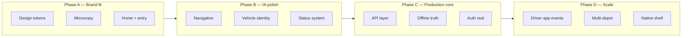

# Veyvio Yard — Implementation Plan

**Created:** July 2026  
**Purpose:** Align the prototype with the [brand foundation](../brand/veyvio-yard-brand-foundation.md), close product gaps, and reach production-ready Yard operations.

**North star:** *Every vehicle. Ready and accounted for.*

---

## 1. Where we are today

### Built and working (prototype)

| Area | Status | Key routes / files |
|------|--------|-------------------|
| Auth & tenancy flow | Mock, local | `/splash` → sign-in → MFA → depot → sync |
| Home board | Live fixtures | `/` — attention, KPIs, departures, inventory |
| Yard map & movements | Live | `/yard/map`, arrivals, stage departure |
| DVSA yard check | Live | `/yard/$id/check` — 29 sections, spot audit |
| Vehicle condition & damage | Phases 1–5 | `/inspections`, condition tab, review, RTS gate |
| Equipment & readiness | Live | Vehicle equipment tab, departure release |
| Tasks | Live | `/tasks` — accept, assign, complete |
| VOR | Live | `/vor` — lifecycle, RTS integration |
| Offline/sync skeleton | Partial | Outbox, IndexedDB bootstrap, sync badge |
| Tests | 75 passing | Domain + startup + bootstrap |

### Brand vs app gaps

| Brand spec | Current app | Priority |
|------------|-------------|----------|
| Yard Teal `#12A89D` primary | Hi-vis orange `#f97316` | High |
| Veyvio Midnight `#0B1526` chrome | `#18181b` accent header | High |
| Status colours (Ready/Attention/VOR hex) | Close but not exact | Medium |
| Manrope marketing typeface | Not loaded | Low |
| Nav: Home · Checks · Vehicles · Yard · More | Home · Vehicles · Scan · Inspections · Tasks · More | Medium |
| Home: operational headline | Partial (“Morning, {name}”) | Medium |
| Voice / microcopy (section 13) | Mixed — some generic toasts | High |
| Splash / welcome brand copy | Not fully aligned | Medium |
| Status never colour-only | Mostly OK; audit needed | Medium |

### Platform gaps (from architecture docs)

- Real API backend (vehicles, checks, defects, sync)
- Production permission enforcement server-side
- Capacitor / native shell
- E2E test suite (Playwright)
- CI pipeline hardening

---

## 2. Recommended phases

---

## Phase A — Brand alignment (2–3 weeks)

**Goal:** The app *looks and sounds* like Veyvio Yard without changing domain logic.

### A1. Design tokens (`src/styles.css`)

- [x] Map CSS variables to brand palette:
  - `--primary` → Yard Teal `#12A89D`
  - `--accent` / header chrome → Veyvio Midnight `#0B1526`
  - `--ring` / links accent → Yard Teal or Veyvio Blue `#2F6BFF` where appropriate
  - `--ok` → `#178C4B`, `--warn` → `#D97706`, `--vor` → `#B42318`
  - `--background` → `#F5F7FA`, text → `#101828` / `#475467` / `#667085`
- [x] Add token aliases: `--yard-teal-soft: #DDF7F3` for info cards
- [x] Load **Manrope** for splash/welcome/marketing routes only
- [x] Update `AppShell` header: Midnight background, teal active states
- [x] Scan FAB: teal not orange
- [x] Document token map in `docs/brand/design-tokens.md`

**Acceptance:** Screenshot comparison vs brand section 16; no orange primary remaining.

### A2. Microcopy pass

- [x] Create `src/copy/yard-messages.ts` — centralised operational strings
- [x] Audit and replace:
  - Sonner toasts (success / warning / error)
  - Empty states (use section 13 examples)
  - Button labels — decisive verbs: “Mark vehicle VOR”, “Move vehicle”, not “Submit”
  - Error boundaries — operational language, offline wording
- [x] VOR / RTS confirmations — high-impact dialogs per section 13
- [x] First-use expansion: **Vehicle off road (VOR)** where shown

**Acceptance:** No user-facing “successfully updated”, “mutation”, “entity” strings.

### A3. Home & entry screens

- [x] **Home** (`_app.index.tsx`):
  - Headline: count-based operational line — e.g. “Three vehicles need attention before service”
  - Reorder: attention → checks due → availability → movements → defects (status before stats)
  - Demote KPI grid below attention or merge into availability summary
- [x] **Splash** (`_public.splash.tsx`): Midnight + campaign line + master tagline footer
- [x] **Welcome**: “Control the yard with confidence” + authorised-teams note

**Acceptance:** Matches brand sections 26–28.

---

## Phase B — Information architecture (1–2 weeks)

**Goal:** Navigation and vehicle records match brand section 25.

### B1. Navigation reconciliation

**Brand target:** Home · Checks · Vehicles · Yard · More

**Proposed mapping (minimal route churn):**

| Brand tab | Implementation | Notes |
|-----------|----------------|-------|
| Home | `/` | Unchanged |
| Checks | `/checks` (+ link from Inspections hub) | DVSA walkarounds |
| Vehicles | `/yard` | Fleet list + vehicle detail tabs |
| Yard | `/yard/map` | Physical location, movements, bays |
| More | `/more` | Settings, VOR, defects, shift |

- [x] Reduce bottom nav to **5 items** (move Tasks + Inspections under More or Home attention links)
- [x] Keep **Scan** as header action or centre FAB on Yard tab (not a sixth nav label)
- [x] Redirect `/inspections` from More + Home attention cards (condition hub stays, not top-level nav)

**Decision needed:** Keep Inspections as 5th tab vs fold into Checks — recommend fold for brand alignment.

### B2. Vehicle identity component

- [x] Extract `VehicleIdentityHeader` component:
  - Registration (prominent, tabular)
  - Fleet number / type
  - Status chip + bay
  - Next trip if on departure line
- [x] Use on: vehicle overview, check wizard, condition tab, VOR detail

### B3. Status chip system

- [x] Align `StatusChip` labels with brand list (Ready, Check due, VOR, Off site, etc.)
- [x] Audit: every coloured status has text label + icon
- [x] VOR distinct treatment (not generic destructive red)

---

## Phase C — Production core (4–8 weeks)

**Goal:** Trustworthy data, offline-first, real auth — yard staff can rely on it live.

### C1. API integration

- [ ] Implement adapters per `docs/architecture/06-api-layer.md`
- [ ] Replace fixture bootstrap with API hydrate + IndexedDB cache
- [ ] Events: `vehicle.vor.marked` → dispatch block (document contract)
- [ ] Condition/damage/repair endpoints

### C2. Offline & sync

- [x] Complete outbox type coverage (checks, damage, repairs, inspections, tasks)
- [x] Visible sync state on write actions (offline save toast + header banner)
- [x] Operational sync copy (brand-aligned queue labels and status messages)
- [x] Conflict policy for damage reviews / VOR

### C3. Auth & permissions

- [ ] Real OIDC / session with refresh
- [ ] Server-enforced `check.spot_audit`, role-based UI gates
- [ ] Depot tenancy from API

**Acceptance:** 24h offline shift simulation; sync on reconnect without data loss.

---

## Phase D — Ecosystem & scale (ongoing)

- [ ] **Driver app** — real damage report ingress (replace `/simulate/driver-report`)
- [ ] **Maintenance app** — defect/VOR handover webhooks
- [ ] **Multi-depot** — controller view across sites
- [ ] **Capacitor** — installable PWA/native, haptics per brand section 22
- [ ] **Analytics** — operational reporting (not vanity charts on home)
- [ ] **ML similarity** — optional cloud vision for evidence compare (replace heuristic hints)

---

## 3. Suggested sprint order (next 4 sprints)

| Sprint | Focus | Deliverables |
|--------|-------|--------------|
| **Sprint 1** | A1 Design tokens + shell | Teal/Midnight theme, header, nav colours, token doc |
| **Sprint 2** | A2 + A3 Copy & home | `yard-messages.ts`, home headline, splash/welcome |
| **Sprint 3** | B1–B3 IA | 5-tab nav, vehicle identity component, status audit |
| **Sprint 4** | C2 Offline UX | Sync visibility, operational offline copy, outbox gaps |

**E2E:** `npm run test:e2e` — 8 Playwright smoke tests (auth bypass + core flows).

---

## 4. What not to do yet

- Full colour rebrand of marketing site (out of scope for app repo)
- Mobbin / paid design tools (free patterns already applied)
- Real-time ML on device
- Rewriting git history on `main` after others have pulled

---

## 5. Success measures

| Measure | Target |
|---------|--------|
| Brand token compliance | 100% primary actions use Yard Teal |
| Microcopy audit | 0 technical error strings in UI |
| Home time-to-action | User sees attention count &lt; 2s |
| Offline clarity | User always knows synced vs pending |
| Test suite | ≥80 tests, E2E smoke on auth + check + VOR |
| Yard questions answered | All 5 visible from home or vehicle detail |

---

## 6. References

- [Brand foundation](../brand/veyvio-yard-brand-foundation.md)
- [Product boundary](../architecture/01-product-boundary.md)
- [Vehicle condition system](../architecture/08-vehicle-condition-damage.md)
- [Yard vehicle check](../architecture/07-yard-vehicle-check.md)
- [Offline sync](../architecture/03-offline-sync.md)
- [API layer](../architecture/06-api-layer.md)
- Agent rule: `.cursor/rules/veyvio-yard-brand.mdc`

---

## 7. Immediate next step

**Start Sprint 1 — Design tokens** (lowest risk, highest visual impact):

1. Update `src/styles.css` variables to brand hex values  
2. Adjust `AppShell`, `BottomNav`, primary `Button` usage  
3. Visual regression pass on Home, Damage review, Yard check wizard  
4. Commit when approved (user-requested only per git rules)

Say **“start Sprint 1”** to begin implementation.
