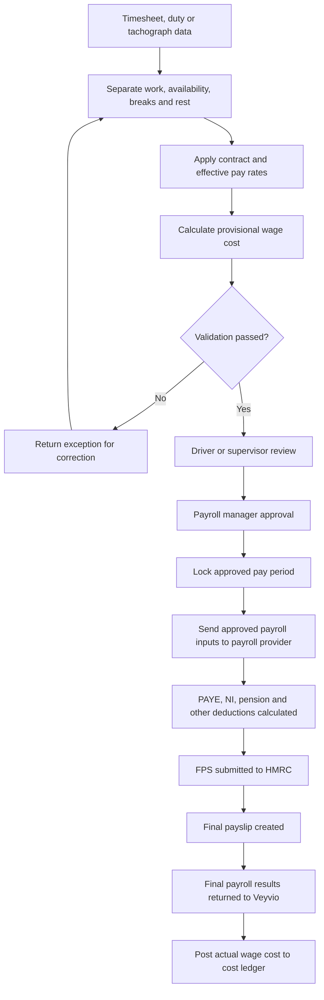
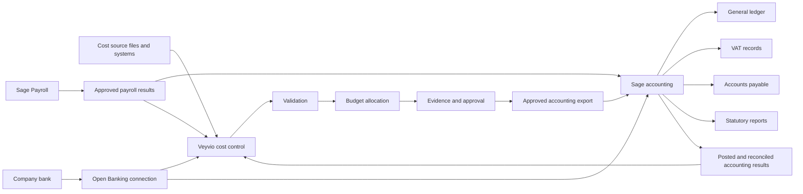
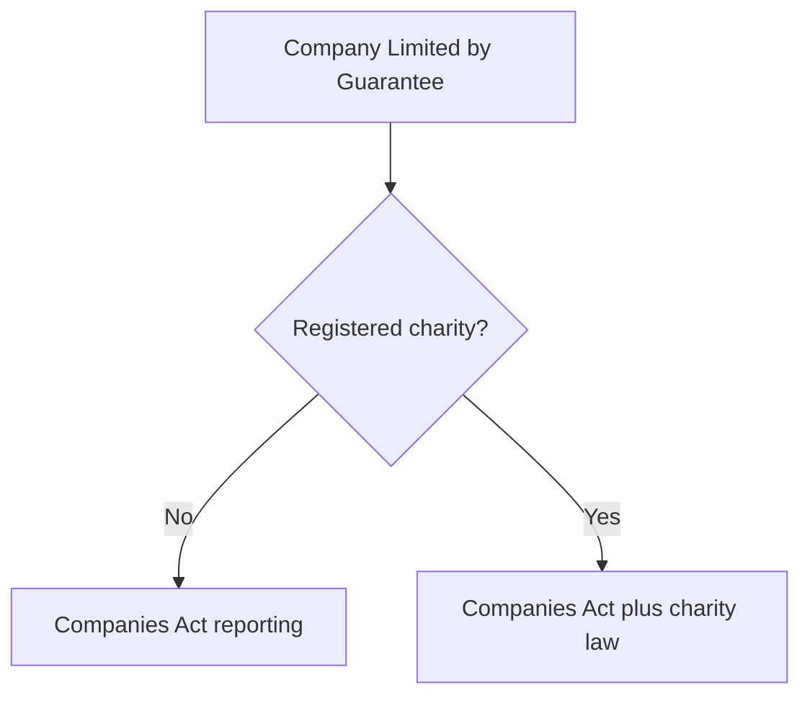

# Cost Control ↔ Combined Blueprint

| Product | Authority | Repo path |
|---------|-----------|-----------|
| Transport ops (Command / Yard / Driver) | Combined Blueprint v2.0 | existing apps |
| Cost Control | Cost Control Master Blueprint v1.2 | `veyvio-cost-control/` |

They share brand parent **Veyvio** but are separate products. Cost Control must not absorb dispatch/booking. Ops apps may later **emit** cost signals (fuel, maintenance) into Cost Control via adapters — never co-authoritative amounts.

**Related deploy guides**

| Topic | Doc |
|-------|-----|
| Sage accounting integration | [`docs/deploy/cost-control-sage.md`](../../docs/deploy/cost-control-sage.md) |
| Open Banking (supporting bank feed) | [`docs/deploy/cost-control-bank-open-banking.md`](../../docs/deploy/cost-control-bank-open-banking.md) |

## Payroll boundary (approved, Jul 2026)

**Status: APPROVED** — Veyvio calculates, approves and forecasts **driver wage costs**; an HMRC-recognised payroll provider performs statutory PAYE, submits to HMRC, and issues final payslips.

Employers who pay drivers directly still need to register with HMRC and operate PAYE — that is an **employer / provider** duty, not a Veyvio product feature.

| Veyvio owns | Recognised payroll provider owns |
|-------------|----------------------------------|
| Wage-cost budgets, pay-rate / OT rules, hour imports | PAYE tax, employee & employer NI calculation |
| Timesheet validation & provisional gross wage cost | Student/postgraduate loans, statutory payments |
| Approval + lock of pay period; adjustment records after lock | Pension deductions, court orders, other statutory deductions |
| Forecast, variance, reconciliation, audit trails | FPS / EPS, tax-year updates |
| Export of approved payroll **inputs** to provider | Final payslips, P45s, P60s; net pay to employees |
| Post **actual** wage cost to cost ledger after provider return | HMRC software recognition / RTI submission engine |

Job-to-be-done: *“What will payroll cost, is it correct, can the CEC afford it?”* — not *“How much tax must be deducted from Sarah and reported to HMRC?”*

Building an HMRC submission engine is an explicit **non-goal**. Full payroll / recognition is only a later programme after import → pre-payroll controls → final reconcile → provider integration are proven.

### Hours → wage cost → provider (approved flow)

**Hard rules**

- No unapproved or disputed hours reach the payroll provider.
- Corrections after lock create an **adjustment record** — never silent overwrite.
- Tachograph driving time is **not** the whole payable day; paid work may include checks, cleaning, loading, passenger assistance, admin, training.
- Each driver-day distinguishes working time, breaks, rest and periods of availability.
- Screens show both **payable hours** (wage cost) and **regulated working time** (compliance) — related, not always identical.
- Effective-dated pay rules: mid-period rate changes split hours across rates.
- Provisional gross must be checked against applicable National Minimum Wage (working time beyond driving may count).
- Holiday pay is not a universal percentage; regular-hours vs irregular/rolled-up rules apply; rolled-up holiday pay shown separately when used. From 6 Apr 2026 employers must retain leave/holiday-pay records ≥ 6 years (employer duty).

**Daily hours categories (cost inputs):** basic, overtime, night, weekend, bank-holiday, training, other work, period of availability (separate), unpaid break (excluded where lawful), paid absence.

**Provisional gross (Veyvio):** basic + overtime + premiums + holiday/sickness/statutory pay inputs + allowances + bonuses + back pay — using effective rates. Provider then applies PAYE/NI/pension for net and statutory outputs.

### Current code hooks

Today’s code: `CostCategory` `wages` + `sourceType: 'payroll_summary'` — summary employer costs only; no employee PII tax engine.

**Phase 2:** organisational structure + `EmployeeCostReference` (external payroll id, role, cost centre, employer cost flags). Board/volunteers may appear unpaid.

**Person wage finance profile (`/wages/people/:id`):** employer-cost / pay-input view — contracted hours, hours completed, OT, holiday, sick, basic + employer NI + pension composition, **masked** NI/bank for provider reconciliation. Explicitly **not** Command admin staff profile and **not** a payslip / PAYE engine. Full cleartext NI and bank account numbers remain out of scope.

**Payroll summary import (Blueprint §11):** CSV lines matched on `external_payroll_id` → variance / unmatched / incomplete allocation exceptions → Reviews queue + pay-period pre-payroll roll-up. Still not FPS/EPS or HMRC submission.

**Phase progress (Jul 2026):**
- Phase 1 hardening: SQL foundation with `organisation_id` on every table (`db/migrations/`); domain tenancy guards; audit events on review actions. App runtime still in-memory until DB is provisioned.
- Phase 2: CEC hierarchy (org → FY → programme → category) + `/budgets/lines/:lineId` variance drill.
- Phase 3: Review workbench — approve / reject / request evidence / reallocate with balanced allocations + immutable audit.
- **Driver wage hours workbench (Jul 2026):** `/wages/hours` (payable vs regulated working time, provisional gross, effective-dated rates, NMW check) + `/wages/approval` (validate → supervisor → payroll manager → lock → provider export → ledger; post-lock adjustments only). Domain: `driver-wage-hours.ts`, `wage-period-workflow.ts`.

## Accounting-system boundary (updated, Jul 2026)

**Status: APPROVED** — Veyvio may use accountant export, Sage or another accounting system.
Sage is optional. Veyvio is **not** an operational ERP and is **not** the single source of truth
for all company data.

**Product definition:** Veyvio is the CLG’s cost-control, forecasting, approval and audit-evidence
platform. The selected accounting system and accountant own the official ledger, tax and statutory
financial records until a separately approved Veyvio double-entry programme is complete.

**Deploy / engineering guide:** [`docs/deploy/cost-control-sage.md`](../../docs/deploy/cost-control-sage.md)

| Capability | Veyvio | Sage |
|------------|--------|------|
| Approved cost budgets | Primary | Summary / reference |
| Cost forecasts | Primary | Optional summary |
| Cost commitments | Primary | Supplier liabilities where posted |
| Cost evidence | Primary | Invoice attachment / reference |
| Cost approvals | Primary | Accounting approval where required |
| Vehicle cost allocation | Primary | Nominal / cost-centre summary |
| Wage-cost planning | Primary | Final payroll journal |
| General ledger | No | Primary |
| Supplier accounts payable | No | Primary |
| VAT accounting and MTD return | No | Primary |
| PAYE calculations and RTI | No | Sage Payroll (or other recognised payroll) |
| Statutory P&L and balance sheet | No | Primary |
| Corporation Tax accounts | No | Accountant / Sage |
| Bank accounting reconciliation | Supporting view | Primary accounting record |
| External audit evidence | Evidence source | Accounting source |
| Bookings, routes and dispatch | No | No — outside this finance app |
| Customer sales and invoicing | No | Sage or another sales system |

### Two sources of truth (do not collapse)

| System | Owns |
|--------|------|
| **Veyvio** | Cost purpose, budget, forecast, commitment, evidence and approval |
| **Selected accounting system / accountant** | Accounting treatment, ledger posting, VAT, statutory accounts and final accounting reconciliation |

### Relationship to the payroll boundary

Payroll and Sage are related but not the same integration:

| Path | Purpose |
|------|---------|
| Veyvio → recognised payroll provider | Pay drivers correctly (inputs out; statutory PAYE stays with provider) |
| Payroll provider / Sage Payroll → Sage accounting | Employer cost journal into the GL |
| Sage → Veyvio | Posted wage-cost confirmation + payment / reconciliation status |

If the CLG uses **Sage Payroll**, that product may be both the PAYE engine and the source of the payroll journal. If it uses another HMRC-recognised payroll product, Veyvio still sends only a **summarised employer journal** to Sage Accounting / Sage 50 — never employee tax codes or full payslip payloads unless an exceptional requirement is agreed.

### Architecture

### What Veyvio sends to Sage

**Approved supplier cost:** Veyvio cost ID, supplier, invoice reference, invoice/accounting dates, net/VAT/gross, Sage nominal + tax codes, cost centre, department, vehicle/programme reference, description, evidence link, approval date.

**Wage costs:** summarised approved payroll journal only — batch reference, pay period, gross wages, employer NI, employer pension, other employer costs, department/cost centre, accounting date. **Not** employee tax codes, deductions or full payslip data unless an exceptional requirement is agreed.

**Vehicle purchases:** supplier invoice, asset description, registration/asset ID, purchase date, net/VAT, proposed asset category, cost centre, evidence. The accountant decides capitalise / expense / depreciate / lease — Veyvio does not make the final statutory accounting decision.

### What Sage returns to Veyvio

Veyvio cost ID, Sage transaction ID, posting date, accounting period, nominal/tax codes, posted net/VAT/gross, posting status, payment status, credit-note/reversal reference, bank reconciliation status, last Sage update.

Display states: Sent → Accepted → Rejected (correction required) → Posted → Paid → Bank reconciled → Reversed/credited.

### Bank dual-import rule

Both Veyvio (Open Banking) and Sage may receive the same bank movement. Responsibilities differ:

- **Veyvio:** timely cost monitoring and **proposed** matching.
- **Sage:** official accounting reconciliation.

Veyvio shows “proposed bank match” until Sage confirms reconciliation. A bank import must **never** create an extra accounting cost merely because both systems saw the transaction.

Identifiers kept separate: `open_banking_transaction_id` · `veyvio_cost_id` · `sage_transaction_id` · `sage_reconciliation_id`.

**Fully reconciled** = approved in Veyvio + posted in Sage + matched to bank + Sage reconciliation confirmed.

### Integration controls (every transmission)

Unique Veyvio transaction ID, idempotency key, request/response timestamps, payload version, Sage business identifier, validation result, retry count, failure reason, responsible actor, source/destination values, immutable event history. Sage rejections enter a visible integration-exception queue — never silent correction.

### Sage product choice — OPEN until CLG confirms

Do not lock the connector until the accountant confirms the product:

| Product | When to consider |
|---------|------------------|
| Sage Accounting | Likely simplest cloud/API-first option for a smaller CLG |
| Sage 50 Accounts | Accountant already on Sage 50 / desktop-oriented processes |
| Sage Payroll / Sage 50 Payroll | PAYE, NI, pensions, RTI, payslips, P45/P60 |
| Sage Intacct | Only if multi-entity / multi-fund complexity emerges |

### Explicit non-goals for this finance app

Customer bookings · routes · dispatch · customer quotes · sales invoicing · debt chasing · full payroll processing · VAT-return preparation · statutory ledger ownership · “single source of truth for all company data”.

**UI:** Settings → Sage connection (mappings, sync status, failed exports). Domain: `integrations/sage/`.

**Phase progress (Jul 2026):** boundary approved; domain export/posting types + Settings demo snapshot shipped; live OAuth / token proxy / export queue **not started** — blocked on product confirmation.

## Bank feed boundary (approved, Jul 2026)

**Show business bank balance + transactions for cost monitoring — not a payments product and not the official accounting reconciliation.**

| Veyvio Cost Control owns | Open Banking / bank owns | Sage owns |
|--------------------------|---------------------------|-----------|
| Display available / ledger balance | Authoritative bank account data | Official bank accounting reconciliation |
| **Proposed** match of bank debits to costs | Payment initiation / Faster Payments | Posted payment ↔ ledger link |
| Feed freshness and stale warnings | Full sort code / account number storage | Final reconciled status returned to Veyvio |
| Demo + AIS adapter until partner connected | PSD2 / Open Banking regulatory perimeter | Dual-import without duplicate costs |

Route: `/bank`. Connect from **Settings**. Account numbers are masked. Setup: [`docs/deploy/cost-control-bank-open-banking.md`](../../docs/deploy/cost-control-bank-open-banking.md). Sage dual-import rule: see Sage section above and [`docs/deploy/cost-control-sage.md`](../../docs/deploy/cost-control-sage.md).

## Financial views & management accounts (decision, Jul 2026)

Accountants start from the **cost ledger and bank reconciliation**. Budget, forecast, cash flow and profit-and-loss / income-and-expenditure are **derived views** of that trusted data — never co-authoritative write paths.

| View | Question | Route |
|------|----------|-------|
| Budget | What were we authorised to spend? | `/budgets` |
| Forecast | What do we now expect to spend or earn? | `/forecast` |
| Cash flow | Will money be in the bank when payments fall due? | `/cash-flow` |
| Management accounts | Surplus / deficit (management I&E) | `/management-accounts` |

**Equations (immutable):**

- Available now = Approved − Actual − Commitments
- Projected final cost = Actual + Commitments + Remaining forecast
- Projected remaining = Approved − Projected final cost

Original approved baseline is immutable; approved changes are tracked separately. Quarterly reviews lock; corrections create a new version (`/budgets/quarterly`, `/board-pack`).

**Income boundary:** keep detailed invoicing / customer management outside Veyvio. Import one controlled income summary from the accounting system for management accounts and board packs only. Mark reports as **management accounts**, not statutory. Accountant approves mappings, accruals, depreciation and adjustments.

## Legal form — Company Limited by Guarantee (approved, Jul 2026)

**Status: APPROVED** — the Cost Control operator entity is modelled as an ordinary **Company Limited by Guarantee (CLG)**: a private limited company without shares; members are guarantors. A CLG is **not** automatically a charity, CIC or non-profit.

| Applies | Does not apply (unless separately registered) |
|---------|-----------------------------------------------|
| Companies Act reporting + Companies House filings | CIC34 / CIC Regulator / statutory CIC asset lock |
| Corporation Tax + normal employer obligations | Automatic Charity Commission regime |
| Members (guarantors) instead of shareholders | Share capital / dividends |
| Audit or exemption assessment under Companies House rules | Automatic full statutory audit |

**Audit exemption (FY beginning on/after 6 Apr 2025):** a private CLG may qualify if it meets **at least two** of: turnover ≤ £15m · assets ≤ £7.5m · ≤ 50 employees — unless articles, members, funder, bank, group or sector rules still require an audit. Directors remain responsible for adequate records and compliant accounts even if exempt.

### Charity registration — OPEN

| If not a charity | If charitable CLG (England/Wales) |
|------------------|-----------------------------------|
| Companies House accounts | Companies House + Charity Commission |
| Corporation Tax return where required | Trustees’ annual report + Charity SORP |
| Audit or exemption assessment | Independent examination / charity audit thresholds |

**Do not build** charity fund accounting, restricted-fund SORP packs or Charity Commission annual-return automation until the operator confirms registration. Thresholds change (e.g. expected Oct 2026) — the accountant confirms the rules for the period.

### Assurance model (approved)

Veyvio supports three levels; **statutory accounts remain in accounting software**:

1. **Continuous internal control** — every transaction checked in-year (evidence, approval, related-party).
2. **Quarterly assurance** — reconcile ledger, bank, payroll, suppliers and budgets; lock snapshot.
3. **Annual external assurance** — locked evidence pack for accountant / independent examiner / auditor.

Traceability chain for every cost: authorised purpose → approved budget → commitment → supporting document → approval → ledger → bank payment → bank reconciliation → annual accounts.

### CLG controls in product

| Control | Route / artefact |
|---------|------------------|
| Directors, guarantor members, connected persons, related suppliers | `/governance` |
| Related-party warning; interested person must not self-approve | Approval bands + register match |
| Funding restrictions (source, purpose, eligible spend, unspent) | `/governance` funding awards |
| Board-approved approval limits | `/governance` (default bands; board must adopt policy) |
| Annual audit evidence workspace | `/audit` |

**Non-goals:** becoming Companies House filing software, producing statutory accounts, or replacing the auditor.

---

## Open decisions register (Cost Control)

Items that block or shape engineering. Update status when the CLG / accountant answers.

| ID | Decision | Status | Blocks |
|----|----------|--------|--------|
| OD-01 | Which Sage product will the accountant use? | **OPEN** | Live Sage OAuth, API adapter, mapping UI |
| OD-02 | Is Sage Payroll the PAYE engine, or another provider? | **OPEN** | Wage-journal shape and return path |
| OD-03 | Charity registration (ordinary CLG vs charitable CLG)? | **OPEN** | Restricted-fund / SORP features |
| OD-04 | Open Banking AIS partner (TrueLayer / Yapily / other) and agent model | **OPEN** | Production bank connect |
| OD-05 | Income summary import format from Sage (management accounts only) | **OPEN** | Board pack income line automation |

**Approved (do not reopen without explicit override):** payroll cost-only boundary · Sage integration (not replacement) · bank as supporting / proposed match · CLG legal form · immutable posted-cost corrections via reversal / credit note / adjustment.
